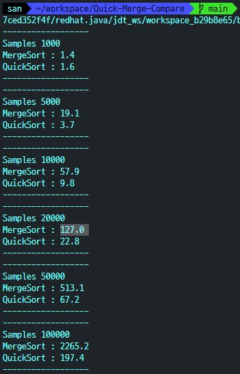
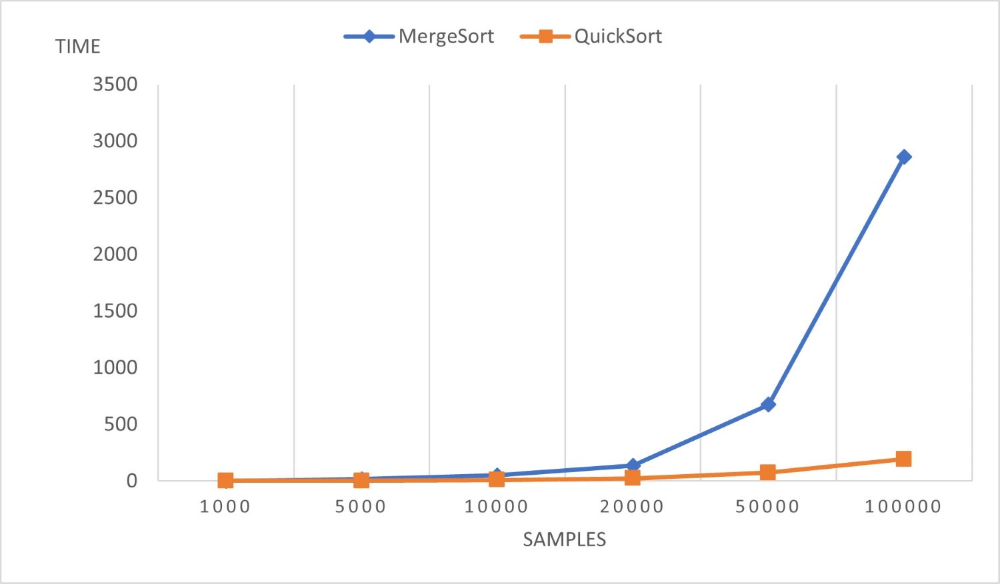

# 레포트 #2
<div style="text-align: right"> 알고리즘 3분반, 32170578, 김산 </div>

## 소스코드

### Main함수

```java
package main.src;
public class Sort {
    public static void main(String[] args) {
        int[] n = {1000, 5000, 10000, 20000, 50000, 100000};

        long start;
        long stop;

        long mergeSum = 0;
        long quickSum = 0;

        double mergesortTime;
        double quicksortTime;

        for (int i = 0; i < n.length; i++) {
            for (int j = 0; j < 10; j++) {
                int []arr1 = Generater.genNumber(n[i]);
                int []arr2 = arr1;
    
                start = System.currentTimeMillis();
                MergeSort.sort(arr1);
                stop = System.currentTimeMillis();
                mergeSum += stop - start;
            
                start = System.currentTimeMillis();
                QuickSort.sort(arr2);
                stop = System.currentTimeMillis();
                quickSum += stop - start;
            }
    
            mergesortTime = mergeSum / 10.0;
            quicksortTime = quickSum / 10.0;
            
            System.out.println("------------------");
            System.out.println("Samples " + n[i]);
            System.out.println("MergeSort : " + mergesortTime);
            System.out.println("QuickSort : " + quicksortTime);
            System.out.println("------------------");
        }
    }
    
}
```

### genNumber함수

랜덤한 숫자 배열을 만드는 부분은 static Generater클래스를 생성하여 genNumber()함수로 구현하였습니다.

```java
package main.src;
import java.lang.Math;

public class Generater {
    public static int[] genNumber(int count) {
        int []array = new int[count];
        for (int i = 0; i < count; i++) {
            array[i] = (int)(Math.random()*999);
        }
        return array;
    }
}
```


## 실행결과



Samples   | 1000 | 5000 | 10000 | 20000 | 50000 | 100000 | 
----------|------|------|-------|-------|-------|--------|
MergeSort | 1.4  | 19.1 | 57.9  | 127.0 | 513.1 | 2265.2 |
QuickSort | 1.6  | 3.7  | 9.8   | 22.8  | 67.2  | 197.4  |


### 그래프

