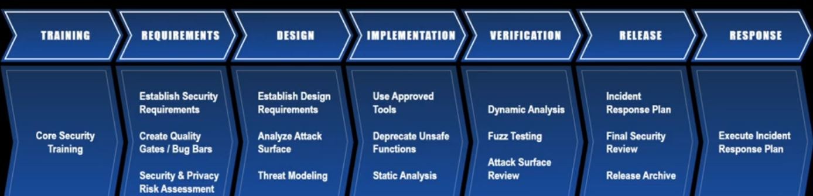

# ISS middle test summary

## Quiz 정리

### 1. What is the difference between information security and computer security?

(컴퓨터 보안 vs 정보 보안)

- 컴퓨터 보안은 주로 디지털 형태의 정보를 중점으로 하는 반면, 정보 보안은 모든 형태의 정보를 대상으로 합니다

### 2. What is the difference between software security and security software?

(소프트웨어 보안 vs 보안 소프트웨어)

- 보안 소프트웨어는 외부 위협으로부터 시스템을 보호하는 소프트웨어를 말하며, 소프트웨어 보안은 악의적인 공격 하에서도 소프트웨어의 기능이 정상적으로 동작하도록 소프트웨어를 개발하고 테스트하는것, 즉, 소프트웨어 개발 프로세스의 전 단계에 걸쳐 보안을 고려하는 것을 말합니다.

### 3. Types of Cyber security attacks

(사이버 공격의 종류)

- Phishing(피싱)
  - 범죄자가 피해자와 이해관계가 있는것 처럼 속여 문자 이메일 링크를 통해 공격
  - Pharming : 정상사이트를 위조하여 공격
- Man in the middle(중간자 공격)
  - 네트워크 패킷을 조작하여 통신 내용을 도청하거나 변조하는 공격 기법
- Drive by download attack(다운로드를 유도한 공격)
  - 희생자의 동의 없이 악의적인 프로그램을 다운로드 하게 만듬
  - 웹 사이트를 방문하거나 이메일 메시지를 볼 때 유혹하는 팝업 윈도우를 클릭할 때 발생
  - 아무것도 클릭하지 않았는데도 다운로드 될수도 있고, 악의적인 이메일 첨부를 오픈하지 않았는데도 다운로드 될 수 있음. -> 브라우저의 취약점 활용
- Password Attacks(패스워드 공격)
  - 패스워드를 도용하여 나쁜 목적으로 사용
- DDos(분산 서비스 거부 공격)
  - 네트워크 패킷을 다량으로 전송, 서버 공격 -> 서비스를 하지 못하게 함(Availability)
- Malvertising
  - 인터넷 광고를 하는것처럼 보여 광고를 보는 사람에게 악성코드를 설치하게 만듬. 
- Rogue antivirus(rogue)
  - 백신 소프트웨어를 사칭하여 이득을 얻는 악성 소프트웨어. 주로 설치된 컴퓨터에 악성코드가 감염되었다는 등의 거짓 내용을 띄워 사용자를 속여 결제 유도

### 4. Good Security Standards follow the 90/10 Rule

좋은 보안표준은 90/10을 따른다는 규칙은 보안의 10%는 기술적으로 해결할 수 있지만, 나머지 90%는 사람이 책임져야하는 부분이기 때문에 보안은 사람이 보안에 대한 지식이 얼마나 많으냐에 따라 달라진다 할 수 있습니다.

따라서 컴퓨터나 모바일 디바이스의 사용자들이 컴퓨터, 장치, 데이터를 안전하게 유지하기위해 이해할 필요가 있습니다.

### 5. Explain how we create good passwords

- 길고 문자 숫자 특수문자를 포함한 암호를 사용 
- 사전의 단어나 사람 이름등의 개인정보를 포함하지 않는다
- 쉽게 추측할 수 없는 패스워드를 만든다.

### 6. Types of Security Threats

**Interruption(가로막기)** : 서비스를 이용하지 못하도록 막는것

- Flooding: TCP flood (SYN flood), Ping flood
- Occupying target server’s resources: A fork bomb (rabbit virus), Repetitive file creation, Deadlock condition
- Destruction of SW or HW, Cutting a communication line

**Interception(가로채기)** : 정보를 중간에서 가로채는 것
- 네트워크 도청(Wiretapping telecommunications networks), 통신망 도청(Eavesdropping on communication)
- Packet sniffing and key logging to capture data from/to a computer system or network
- Illicit copying of files or programs

**Modification(변조)** : 공격자가 트랜젝션을 가로채 새로운 내용으로 바꾼다음 수신자에게 전달

- User / Credential counterfeiting, Email spoofing, Fake message
- Changing information stored in data files
- Reconfiguring system HW or network topologies

**Fabrication(위조)** : 위조 공격, 공격자가 임의로 트랜젝션을 송신자가 보낸것처럼 위조
- User/credential counter feiting, email spoofing, fake message
- Spoofing a web site or other network service
- Replaying previously intercepted messages

### 7. What can Trudy do to make malware more “effective”?

멀웨어를 효율적으로 동작하게 하기 위해서 공격대상의 패스워드를 Intercetpion하여 접근 권한을 얻거나, 백신 소프트웨어의 동작을 Interruption하여 멀웨어를 탐지하지 못하도록 합니다. 

### 8. Explain three properties (or features) of cryptographic hash functions

1. **One-way-function**
- 단방향 함수로 출력을 통해 입력을 구할 수 없다.
2. **Avalanche effect**
- 입력이 조금만 달라져도 출력이 크게 달라진다.
- 따라서 해시값으로 부터 입력을 구하기 어렵다
3. **데이터 무결성을 침해하는 공격을 탐지할 수 있다.**
- 메시지와 MAC를 같이 보내서 메세지가 변조되면, MAC와 매칭이 되지 않으므로 데이터 무결성이 침해되었다 볼 수 있다.

### 9. What is Content Delivery Networks (CDNs) and how it works?

**CDN**

- 컨텐츠를 효율적으로 전달하기 위해 여러 노드를 가진 네트워크에 데이터를 저장하여 제공하는 시스템
- 인터넷 서비스 제공자에 직접 연결되어 데이터를 전송하기 때문에 콘텐츠에 대한 병목을 피할 수 있다.

### 10. Which attack is generally hard to be detected between passive and active attack? Why?

Passive attack의 경우 본래 시스템 자원에 직접 영향을 주지 않기 때문에 공격을 탐지하기 어렵습니다. 반면 Active attack은 시스템 자원을 변경하기 때문에 passive attack에 비해 탐지가 용이한 편입니다. 

### 11. What is the main difference(s) between traditional SDLC and Microsoft SDL

**SLDC**

- 공격자에 의해서 악용될 수 있는 취약점을 줄이고, 남은 취약점들의 심각 수준을 완화하는것을 목표로 한다
- 소프트웨어 개발 프로세스에 보안에 관계된 검사와 대책을 추가하는 것이다

**Microsoft SDL**

- 보안 내재화/보안 설계 철학을 사용한다
- 개발 문화와 개발단계 전반에 걸쳐 영향을 미친다.

### 12. Explain the main difference(s) between bug and vulnerability in S/W

(버그 vs 취약점)

- 버그의 경우 제품의 약점으로 소프트웨어의 정상적인 수행에 영향을 줄 수 있습니다.
- 반면 취약점은 소프트웨어 하드웨어에 존재하는 결점 결함 버그 오류 등을 말한다. 코드, 설계, 아키텍쳐에 존재할 수 있으며, 악용되어 confidentiality, integrity, availability에 영향을 줄수 있는 약점을 말합니다. 즉 발현된 약점을 취약점이라 합니다.
  - 이러한 취약점을 통해 정보를 임의로 변경하거나 접근하거나, 실행에 간섭하거나, 올바르지 않은 행위를 수행할 수 있습니다.

----------

## 기출 정리

### 1. 최신 스마트 냉장고는 인터넷에 연결되어 사용되고 있어 connected refrigerator 라고 한다 사이버 위협 관점 에서 internet connected refrigerator 가 일반 데스크톱 PC 보다 더 위험한 이유를 자세히 설명하시오

- IoT장치의 경우 성능의 제약으로 인해 백신 소프트웨어를 운용하기 힘듭니다.
- Software update가 용이하지 않아 최근에 발견된 보안 위협에 취약할 수 있습니다.
- IoT장치의 통신장치를 통해 침입할수 있는 방법이 늘어서 취약점이 일반 냉장고에 비해 더 많습니다
- IoT장치의 대부분은 무선 네트워크 상에 연결되어 같은 네트워크의 다른 장치들을 위협할 수 있습니다.

### 2. Internet connected refrigerator를 보안 위협들로부터 안전하게 보호하기 위해서 취할 수 있는 방안 행위 들을 모두 나열하고 자세히 설명하시오

- 펌웨어 업데이트에는 최근 발견된 취약점에 대한 업데이트가 존재합니다. 따라서 자주 firmware를 업데이트하여 최근 발견된 취약점에 대해 대비합니다
- 네트워크 방화벽을 통해 인가되지 않은 사용자의 접근을 차단합니다.

### 3. 인터넷 뱅킹 위협

#### STRIDE

##### Spoofing
- DNS spoofing : 인터넷 뱅킹사이트와 유사한 사이트를 개설하여 계좌번호와 같은 민감한 개인정보를 Pharming할 수 있다.
- ARP spoofing : 네트워크상에 침입하여 서버와 클라이언트 사이의 정보를 공격자가 가로채(Intercept) 확인할 수 있습니다. 중간자 공격이라고도 합니다. 
- 방어기법 
  - 전자서명을 통해 사이트의 진위여부를 확인한다(Authentication)
  - 프로토콜 및 암호화 패킷인 해쉬, 대칭키 암호기법을 활용하여 데이터 패킷을 암호화하여 기밀성을 지킬 수 있다.(Confidentiality)

##### Tampering
- 계좌 내역이나 인출시 사용되는 정보를 변조하는 공격이 가능합니다
- 방어기법
  - 암호학적 해쉬 함수(CHF)를 이용하여 데이터의 변조여부를 확인합니다. CHF에서는 입력값으로 출력값을 확인하는 것만 가능하고(one way function), 데이터가 조금만 수정되어도 출력값이 크게 바뀌기 때문에(Avalanche effect) 데이터의 integrity를 보장할 수 있습니다. 

##### Repudiation
- fabrication을 통해 서버에 침입한 사실을 속여 공격자를 추적하기 어렵게 할 수 있습니다.
- 자신의 private key만으로 암호화하는 전자 서명을 통해 부인방지를 달성할 수 있습니다.

##### Information Disclosure
- 데이터 유출, pharming등으로 정보가 유출 될 수 있습니다, AOB에서 비밀번호, 계좌 번호 등의 민감한 개인정보가 유출될 수 있습니다.
- 중간자 공격, Spoofing을 통해 데이터가 유출 될 수 있습니다.
- 방어기법
  - 대칭키 암호기법을 사용하여 정보를 암호화하여 저장합니다

##### Denial of sevice
- 서버가 감당할수 없는양의 패킷을 보내거나하는 방식으로 정상적으로 서비스를 할 수 없게 만듭니다
- CDN(컨텐츠를 효율적으로 전달하기 위해 여러 노드를 가진 네트워크에 데이터를 저장하여 제공하는 시스템)의 경우 인터넷 서비스 제공자에 직접 연결되어 데이터를 전송하기 때문에 콘텐츠에 대한 병목을 피할 수 있습니다.

##### Elevation of Privilege

- 공격자가 인가되지 않은 수단을 통해 권한을 상승시켜, 여러 민감한 정보에 접근할 수 있습니다.
- 강력한 접근제어(Strong access control)를 통해 사용자의 authorization을 제한하여 예방할 수 있습니다.

### 4. Passive attack / Active attack

#### Passive attack
- Passive attack은 시스템 자원에 영향을 주지 않는 공격으로 Packet sniffing, key logging과 같이 Interception공격이 대표적인 passive attack의 사례입니다
- Active attack은 시스템 자원을 변경하는 공격으로 파일 내용을 임의로 변경하거나, 프로그램을 임의로 변경하여 악의적으로 사용하는것, system이나, network topology를 임의로 재구성하는것 등이 대표적인 active attack의 사례입니다.

Spoofing과 같은 passive attack은 직접 자원을 변경하지 않아 탐지가 어렵지만, tampering과 같은 active attack은 직접 자원을 변조하여 탐지가 상대적으로 용이하다 볼 수 있습니다. 

### 5. 사용자 인증방식 (1) ID/ 패스워드 방식 (2) 생체인증 방식 지문이나 홍채를 사용한 방식 장단점

1번 방식의 경우 사용자 인지기반의 인증으로 구현이 상대적으로 쉽지만, 키로깅과 같은 공격에 취약하고, 쉽게 유추할수 없는 패스워드를 사용해야하는 등 패스워드 관리정책이 필요합니다. 반면 생체인증 방식의 경우 사용자 특성 기반의 인증으로 패스워드 방식에 비해 구현이 복잡하지만, 강력한 인증을 보장합니다.

### 6. 한국에 있는 길동이 송신자 가 제작한 2GB 영화를 미국의 Bob 수신자 에게 암호화하여 안전하고 효율적으로 전송하고자 한다 둘은 먼저 어떤 암호화 방식 들 을 사용할 것인지를 정한 다음 , 진행해야 한다 어떤 암호화방식을 사용하여 어떻게 전송하는 것이 안전하면서 효율적인지를 설명하시오

영화와 같은 용량이 큰 데이터의 경우 복잡한 암호화 방식을 사용하면 암호화 복호화 과정에서 큰 시간이 소요됩니다. 따라서 AES와 같은 대칭키 암호화 알고리즘을 사용하여 전송하는것이 효율적입니다.  

- 먼저 송신자와 수신자가 서로 같은 public key를 갖도록 합니다.
- 인증이후 대칭키를 서로의 public key로 암호화합니다. 이대 효율성을 위해 해쉬를 사용할 수 있습니다.
- 대칭키를 public key암호기법을 통해 교환하고 2GB의 메시지를 블록단위로 암호화 하여 전송합니다. 수신자는 대칭키로 복호화하여 데이터를 수신합니다. 

### 7. 피싱의 유형을 2가지 이상 설명, 이러한 피싱 방지방법

- 공격자가 공격대상과 사회적 친분이 있는것처럼 가장하여 문자, 이메일을 통해 멀웨어 설치 유도
- 유사한 사이트를 제작하여 민감한 개인정보를 입력하도록 유도

- 방지방법 : 이메일, 문자의 링크를 통한 웹사이트 접속을 자제하고, 민감한 개인정보를 입력할 경우 정상적인 사이트 주소인지 확인

### 8. 안드로이드 보안 위협

- Application Risk : 악의적인 애플리케이션으로 인한 보안 위협
- Device Risks : 루팅/탈옥, 업데이트 되지 않은 OS의 보안취약점, 멀웨어로 인한 보안 위협
- Session Risks : 안전하지 않은 연결, SMS forwarding으로 인한 위협

**해결 방법**
- 정적, 동적분석을 통한 취약점 제거
- Build Runtime protection
- mobile SDK solution을 통한 멀웨어에 감염된 디바이스 접근 제한
- mobile SDK를 통한 루팅/탈옥 된 디바이스의 접근 제한

### 9. 버그바운티 제도 운영 이유
- 해킹피해를 사전에 예방하기 위해, 보안취약점에 포상금을 걸고 제보를 받는 버그 바운티 제도
- 다수 사용자들의 집단지성을 통해 취약점을 찾아낼 수 있는 플랫폼으로 신고자는 포상을 받고, 기업은 버그를 발견해 보안성을 높일 수 있는 좋은 상생 방안이기 때문

### 10. Microsoft SDL에서 정적분석(static analysis), 동적분석(dynamic analysis)

**정적분석(static analysis)**
- 프로그램을 실행하지 않고 코드를 통해 프로그램을 분석하는 기법으로 SDL Implementation단계에 속합니다.
- 장점 : 분석속도가 빠르다
- 단점 : 코드를 매번 다르게 암호화하는 멀웨어 탐지에 불리하고, 소프트웨어가 예상치 못한 수행 혹은 처리에 관해 쉽게 탐지하지 못함

**동적분석(dynamic analysis)**
- 에뮬레이터를 활용하여 가상공간에서 수행시켜 분석하는것으로 SDL Verification단계에 속합니다.
- 장점 : 실제 동작시켜 테스트하여 정적분석으로 발견하지 못한 버그 탐지 가능
- 단점 : 시간이 오래걸리고 가상공간 구축을 위한 비용이 든다

**Fuzzying Test**
- 소스코드 없이 실행파일만으로 예측하지 못한 무작위 입력값을 주어서 소프트웨어의 버그를 탐지하는 기법
- 공격자 방어자 모두 활용하는 방법

### 11. Penetrate & patch
소프트웨어 개발 이후에 발생하는 문제점/취양점을 그때 그때 패치하는 방법
1. 비용이 많이든다
2. 유저들이 각자 업데이트해야하는 어려움이 있다
3. 공격자들은 패치내용을 기반으로 취약점을 찾기 수월하다
4. 개발자들은 현 상황에서 고칠 수 있는것만 고친다
5. 패치를 통해 취약점이 발생할 수 있다.

따라서 구현단계에서 부터 보안을 내재화하는것이 필요하다.

### 12. 컴퓨터 웜과 ZOMIBE의 특징 비교설명
- 컴퓨터 웜은 사람의 개입 없이 네트워크상에서 자가 전파 및 복제가 가능합니다.
- 봇(Bot)은 바이러스와 웜을 통해 컴퓨터에 설치됩니다. 봇은 사용자 몰래 컴퓨터를 원격으로 조작하여 작업을 수행할 수 있습니다. 봇은 사용자의 컴퓨터에 대한 백도어를 허용하여 제어 권한을 얻은 다음 컴퓨터를 좀비로 만듭니다.

### 13. 멀웨어 은닉 기법
- 코드 난독화를 통한 정적분석 회피

### 14. 바이러스와 웜의 차이점

|               | 바이러스 | 웜   |
| ------------- | -------- | ---- |
| 자가복제      | O        | O    |
| 독자적 수행   | X        | O    |
| 네트워크 전파 | X        | O    |

### 15. 멀웨어로부터 보호하기위한 기법

- 방화벽을 사용하여 인가되지 않은 사용자의 접근을 제한한다
- 시스템을 지속적으로 업데이트하여 취약점을 제거한다.
- 쉽게 추측할 수 없는 좋은 패스워드를 사용한다
- 알수없는 링크나, 첨부파일을 클릭하고 다운로드하지 않는다
- 

## CWE

| Rank | ID      | Name                                                                                             |
| ---- | ------- | ------------------------------------------------------------------------------------------------ |
| [1]  | CWE-79  | Improper Neutralization of Input During Web Page Generation ('Cross-site Scripting')	46.82       |
| [2]  | CWE-787 | Out-of-bounds Write	46.17                                                                        |
| [3]  | CWE-20  | Improper Input Validation	33.47                                                                  |
| [4]  | CWE-125 | Out-of-bounds Read	26.50                                                                         |
| [5]  | CWE-119 | Improper Restriction of Operations within the Bounds of a Memory Buffer	23.73                    |
| [6]  | CWE-89  | Improper Neutralization of Special Elements used in an SQL Command ('SQL Injection')	20.69       |
| [7]  | CWE-200 | Exposure of Sensitive Information to an Unauthorized Actor	19.16                                 |
| [8]  | CWE-416 | Use After Free	18.87                                                                             |
| [9]  | CWE-352 | Cross-Site Request Forgery (CSRF)	17.29                                                          |
| [10] | CWE-78  | Improper Neutralization of Special Elements used in an OS Command ('OS Command Injection')	16.44 |
| [11] | CWE-190 | Integer Overflow or Wraparound	15.81                                                             |
| [12] | CWE-22  | Improper Limitation of a Pathname to a Restricted Directory ('Path Traversal')	13.67             |
| [13] | CWE-476 | NULL Pointer Dereference	8.35                                                                    |
| [14] | CWE-287 | Improper Authentication	8.17                                                                     |
| [15] | CWE-434 | Unrestricted Upload of File with Dangerous Type	7.38                                             |
| [16] | CWE-732 | Incorrect Permission Assignment for Critical Resource	6.95                                       |
| [17] | CWE-94  | Improper Control of Generation of Code ('Code Injection')	6.53                                   |
| [18] | CWE-522 | Insufficiently Protected Credentials	5.49                                                        |
| [19] | CWE-611 | Improper Restriction of XML External Entity Reference	5.33                                       |
| [20] | CWE-798 | Use of Hard-coded Credentials	5.19                                                               |
| [21] | CWE-502 | Deserialization of Untrusted Data	4.93                                                           |
| [22] | CWE-269 | Improper Privilege Management	4.87                                                               |
| [23] | CWE-400 | Uncontrolled Resource Consumption	4.14                                                           |
| [24] | CWE-306 | Missing Authentication for Critical Function	3.85                                                |
| [25] | CWE-862 | Missing Authorization	3.77                                                                       |
# SW보안개론

## 1주차 2

### Data vs Information

- 컴퓨터 : 데이터와 정보를 처리하고 결과를 제공하는 기기
  - 범용 목적
    - Desktop, Server
    - Laptops, Tablets
    - Smart Phones
  - 특수 목적(Embedded devices)
    - Router, AP, Smart-meter
    - Gaming consoles, Robot vaccums
    - Industrial controllers


|       데이터        |       정보        |
| :-----------------: | :---------------: |
|      Raw facts      | Useful & Relevant |
|     Unorganized     |     Organized     |
|     Unprocessed     |     processed     |
| Chaotic or Unsorted | Ordered or Sorted |
| Input to a Process  | Output of Process |

> 정보, 데이터의 중요성 증가

### 정보기술(IT)

데이터나 정보를 처리하거나 배포할 목적으로 네트웍이나 컴퓨터 시스템을 개발하거나 활용하는 기술

- 직업
  - IT 공학자 : 새로운 소프트웨어나 하드웨어를 개발하거나 업그래이드 하는 사람.
  - IT 관리자
  - IT 설계자
  - IT 매니저 
  - IT 보안전문가 : 보안프로그램을 제작하거나 실행하여 시스템의 security와 safety를 유지하는 사람

### SW 공학자 vs SW 개발자

- SW 공학자 : 개발, 테스트, 유지보수

> 요구사항 분석 (Document) > 설계 (Software architecture) > 개발 (Implementation) > 검증 (Verification) > 유지보수(Maintenance)

전체 과정에 관여하기 때문에 이슈관리의 스케일이 큼.

- SW 개발자 : 다양한 유형의 컴퓨터에서 수행될 소프트웨어를 구현하는 전문가, 주로 구현단계에 기여

제한된 규모의 이슈에 관여

### Information System

데이터, 소프트웨어, 하드웨어, 네트워크, 사람, procedures, policies 까지 포함

> procedures, policies는 정보를 처리하거나 배포하는데 관련되어 있는 절차나 정책을 말함.

각 요소는 단점, 강점, 보안 요구사항이 존재

정보는

- 하드웨어에 저장되고
- 소프트웨어에 의해 처리되고
- communication에 의해 전송되고
- 사람에 의해 사용되고
- policies에 의해 통제된다.

> 데이터와 정보는 밀접한 관련이 있다

---

## 1주차 3

보안 : 위협이 없는 안전한 상태, 공격자가 있는 상황에서도 원하는 특성을 만족하는 상황

최근 동향

- Crypto miners (38%) : 암호화폐 채굴 강제하는 공격
- Botnet (28%) : 서비스 거부공격(DDOS)에 주로 악용되는 악성코드
- Mobile (27%) : 모바일 공격
- Banking (18%) : 은행을 공격하는 사이버 공격, 피싱
- Infostealer (18%) : 정보유출
- Ransomware (7%) : 데이터 암호화 시켜서 돈을 요구

공격 방식

- Interruption : 정보의 흐름을 가로막기(DDOS공격)
- Interception : 가로채기, 도청(패킷 캡처)
- Modification : 데이터 변조 공격
- Fabrication : 데이터 위조 공격

보안의 중요한 속성(CIA)

- Confidentiality : 권한을 가진사람만이 정보에 접근(도청공격 방어)
- Integrity : 정보에 대한 인가를 가진 사람만이 정보를 수정할 수 있음(변조공격 방어)
- Availability : 인가된 사용자만이 정보에 접근(DDOS공격 방어)
- Authenticity, Anonymity...

정보 보안 - 인가되지 않은것으로부터 정보를 보호하는것

- 접근
- 사용
- 기록
- 분열(정보의 일부를 알아보지 못하게 하는것)
- 파괴
- 변조

### What is computer security

컴퓨터 시스템을 적대적인 환경으로부터 보호하는것을 정보보안이라고 한다.

### 컴퓨터 보안 vs 정보보안

컴퓨터 보안 - 디지털 형태의 정보만을 주로 다룸

정보 보안(디지털+아날로그 정보) > 컴퓨터 보안(디지털 형태의 정보)

> 공통점은 컴퓨터 시스템과 네트워크를 다양한 위협으로부터 보호하는것

# Week2

시스템 보안은 정보보안의 부분집합

## 소프트웨어 보안

### 소프트웨어의 종류

- Application software
- System software
  - operating systems
  - device drivers
  - uitlities
- Malicious software
  - Spyware : 정보 변형
  - Adware : 광고
  - Ransomware : 파일 암호화

소프트웨어의 중요성이 갈수록 높아짐에 따라 나쁜 소프트웨어도 증가하고 있다.

### 소프트웨어 보안의 정의

- By Laurie Wiliams - NC state
  - 악의적인 공격 하에서도 소프트웨어의 기능이 정상적으로 동작하도록 소프트웨어를 개발하고  테스트하는 아이디어.
    - Firewalling vulnerabilities(x), 취약점 차단과는 다르다.
    - Reacting penetrate and patch(x), 사후 대책과는 다르다.(수동적)
  - 소프트웨어와 관련된 보안 위험을 이해하고 예방하고 완화하는 것
- By Meenakshi Mani & Tanvi Shah
  - 안전한 소프트웨어를 구현하는 모든 것
  - 소프트웨어 보안을 위해 설계하고 구현하고 테스트하는 과정 모두를 말함
  - Pro-active approach,미리 예방하는 접근법(능동적), 소프트웨어를 구현할 때 보안을 내재화 시키자

Pro-active <-> Reactive

### 소프트웨어 개발 프로세스

>Requirements -> Design -> Implementation -> Verification -> Maintenace

>Requirements Analysis -> System Analysis -> System Design -> Implementation -> Development -> Support -> Integration & Testing

각 단계에서 보안을 고려하는 것이 소프트웨어 보안이다.

- Security engineering : 보안 요소(security aspect)에 중점을 둔 공학에서 특정한 분야
  - disruption source를 안전하게 다룰 수 있는 요소들을 다룸
- Software Security : 소프트웨어 개발 프로세스의 전 단계에 걸쳐 보안을 고려하는 것

### SDL(Security Development Lifecycle)

- SDL의 두 가지 목표
  - 공격자에 의해서 악용될 수 있는 취약점을 줄이는 것
  - 남은 취약점들의 심각한 수준을 완화하는 것

- SD3+C
  - Secure by Design : 설계할 때부터 보안 고려
  - Secure by Default : 기본적으로 취약점이 없는 프로그램
  - Secure in Deployment and Communication

SDL은 소프트웨어 개발 프로세스에 보안에 관계된 검사와 대책을 추가하는 것

- Microsoft Security Development Lifecycle
  - 보안 내재화, 보안 설계 철학


Software Security $\not=$ Suecurity Software

### Some famous real world attacks

- Ransomware
  - WannaCry ransomware
  - 컴퓨터 시스템을 감염시켜 데이터 접근을 제한하고 돈을 지불 요구
- 비대면 환경의 보안 위협
  - 화상 수업,회의 방해, 취약점 익스플로잇 후 애플리케이션 장악
  - 다크웹을 통해 탈취된 계정정보, 내부정보 판매
  - AI 해킹지능화, 랜섬웨어 고도화, 산업설비 위협, 개인정보 보호 중요성 증대
  - 클라우드 대상 공격 증가
  - 의료분야 집중 공격

- 국가 기반시설 제어망에 대한 사이버 테러, OT 보안 전문 도구 통해 선제적 보안 체계 구축 필요
  - OT : 스마트팩토리, 사회 기반시설, 산업용 시설을 모니터링 하기 위해 사용되는 소프트웨어, 기반시설을 위한 시스템

### 요약

- 데이터와 정보의 차이
- Information, Information System
- Computer Security : 디지털로 된 데이터를 관리하고 보호
- Software Security : 소프트를 개발 전 과정에서 보안을 내재화 해야 한다.
  - System Security, Network Security, Internet Security, Web Security, Mobile Security, ...
- Some famous real world attacks
  - ransomware
  - 비대면 환경의 보안 위협

### 왜 보안이 중요한가

- 데이터와 정보를 보호하는데에도 중요
- 성공적인 비즈니스를 위해 중요
- 한 나라의 경제, 안전을 위해 보안이 중요

### Real world threats/attacks

- 심장박동기 해킹
- 야후 5억명의 개인정보 유출
- 링크드인 개인정보 유출
- 가짜 윈도우10 업데이트 -> 랜섬웨어 공격
- 전력망을 공격하는 악성코드(BlackEnergy malware)
- 2017년 Petya 우크라이나 공격, 랜섬웨어보다 큰 손상을 일으킴
  - Master file table을 암호화 시켜 restart함 -> 부팅 불가능

- 2017 cyberattacks on Ukraine
  - NotPetyua는 일종의 사이버 무기
  - Notpetya는 MEDoc(세무회계 sw)의 업데이트 기능을 통해 감염되어 확산됨
  - MeDoc은 우크라이나의 회계 sw패키지
  - backdoor를 통해 전파
  - worm : 스스로 복제
    - worm이 notpetya를 전파시켰다

- 자율 자동차 보안
  - 2018년 9월 테슬라 애플리케이션을 해킹해 자동차를 훔쳐 도주
  - 세계 자동차 대상 사이버 공격 신고 건수 증가
  - 주로 무선도어 잠금장치, 제작사 서버 공격
  - 국토교통부 -> 자율협력 도로 인프라 보안 대책 확보

### 사이버 공격의 유형

- 피싱
  - 범죄자가 피해자와 이해관계가 있는것 처럼 속여 문자 이메일 링크를 통해 공격
  - Pharming : 정상사이트를 위조하여 공격
- Man in the middle(중간자 공격)
  - 네트워크 패킷을 조작하여 통신 내용을 도청하거나 변조하는 공격 기법
- Drive by download attack
  - 희생자의 동의 없이 악의적인 프로그램을 다운로드 하게 만듬
  - 웹 사이트를 방문하거나 이메일 메시지를 볼 때 유혹하는 팝업 윈도우를 클릭할 때 발생
  - 아무것도 클릭하지 않았는데도 다운로드 될수도 있고, 악의적인 이메일 첨부를 오픈하지 않았는데도 다운로드 될 수 있음. -> 브라우저의 취약점 활용
- Password Attacks
  - 패스워드를 도용하여 나쁜 목적으로 사용
- DDos
  - 분산 서비스 거부 공격
  - 네트워크 패킷을 다량으로 전송, 서버 공격
- Malvertising
  - 인터넷 광고를 하는것처럼 보여 광고를 보는 사람에게 악성코드를 설치하게 만듬. 
- Rogue antivirus
  - 백신 소프트웨어를 사칭하여 이득을 얻는 악성 소프트웨어. 주로 설치된 컴퓨터에 악성코드가 감염되었다는 등의 거짓 내용을 띄워 사용자를 속여 결제 유도

### arya college의 사이버 보안 가이드

- 학교 내에서의 사이버 위협 보호
  - VPN을 사용, 네트웍 도메인 중간에 확인, 자동으로 연결되는 기능 비활성화
  - 랩탑을 위치를 추적하는 소프트웨어 설치
  - 사이트에 민감한 정보를 입력하지 말라, 위협이 있어보이는 사이트를 방문하지 말라
  - 체크 카드를 사용할때 ATM을 잘 확인해라.
    - 화면이 깨지거나 플라스틱 장치가 있는 ATM 조심
    - 카드 슬롯에 잘 들어가지 않으면 사용하지 말것
    - pin입력시 키패드를 가리고 할것 ... 등등

# 3주차 강의 필기

## Week 3-1

## 도용된 신용카드의 위협

### Scenario 1 : 멀웨어 해킹에 의한 유출

- Corporate server : 회사, 은행의 서버에 악성코드 설치
- Public computer : 공용 컴퓨터(pc방, 스마트 오피스)에 설치된 spyware, keylogger와 같은 소프트웨어로 인해 유출
- Public server : 공공기관, 네이버, 다음 과 같은 서버를 감염시킨 malware로 인한 유출

### Scenario 2 : 피싱으로 인한 유출

- 이메일을 통한 공격 : 은행, 회사동료로 가장하여 링크를 통해 링크를 클릭하거나 첨부파일을 다운로드하게 함. 공격자가 희생자에게 사회적 친분이 있는것으로 가장 멀웨어 설치 유도.

### 도용한 신용카드 번호는 어떻게 되나?

- 신용카드 broker는 black market, 다크웹을 통해 신용카드 번호를 거래

은행의 계정 정보에도 접근하여 거래

- Personal Identification Number가 있으면 가격이 올라감
- 은행 잔고가 많으면 가격이 더 올라감

이외에도 다양한 개인정보가 다크웹에서 거래되고있음.

- 사회보장번호
- 온라인 거래서비스 로그인 정보
- 신용카드, 체크카드 번호
- 운전면허, loyalty accounts, 학위, 여권, 금융권이외 로그인 정보, 구독 서비스, 의료 정보

## 누가 컴퓨터 보안을 책임져야 하는가

### 어떤것들이 해킹 가능한가?

- 거의 모든것들이 해킹 가능
- IoT의 활성화로 냉장고도 해킹 가능해짐

### 디지털 전환 시대에서의 사이버 보안

- 자동차 보안
- AI 자율주행, 자동차도 위협 대상
- 의료기기, IoT보안
- 클라우드 보안
- 5G 보안
- AI보안 - AI를 통해 침입 탐지 시스템 공격
- 정보보안 분석가 -> 유망 직업

인터넷에 연결되는 모든 전자기기는 해킹 공격 대상

- home camera설치로 인한 해킹 사례

### 좋은 보안 표준은 90/10 규칙을 따른다

- 10% : 기술적으로 해결
- 90% : 사람의 책임, 보안에 대한 지식이 얼마나 많으냐에따라 달라짐

E.g - 도어락이 담당하는 보안은 10%, 사람이 항상 번호가 노출되지않고, 문이 닫혀있는지등 잘 확인해야 함.

따라서 컴퓨터나 모바일 디바이스의 사용자들이 컴퓨터, 장치, 데이터를 안전하게 유지하기위해 이해할 필요가 있다.

- 컴퓨터 보안의 책임은 모두에게 있다.

최근 20년 동안 기술로 인해 공간에 대한 종속성이 사라짐.

- 보안은 컴퓨터나 스마트폰을 사용하는 개개인의 책임
- 인터넷은 매우 위험한 장소가 될 수 있다.
- 부주의로 인해 컴퓨터가 위협에 처했다면 당신의 컴퓨터에 연결되어있는 모든 컴퓨터에 위협이 될 수 있다.

**공격자에 의해 장악된 컴퓨터는 어떤 용도로 악용될수 있는가?**

### Cybersecurity skills in demand!

전체적으로 수요대비 공급 인력이 매우 낮음.

### Top Compute Cybersecurity skills in High Demand

- 문제 해결 능력
- 기술적인 적성, 자질
  - 네트워크 모니터링 기법 구현, 실시간 보안 솔루션 등을 할수 있어야 함
- 다양한 플렛폼에 대한 보안지식이 있어야 함
- 세부 사항에 대해서 관심이 있어야 함
  - 취약점, 위협을 효과적으로 방지하기 위해서 세세한 부분을 따져야 함.
- 의사소통 능력
- 기본적인 컴퓨터 포렌식에 대한 능력 -> 침해사고 대응 
- 배우려는 욕구
- 해킹에 대한 이해

### Importance of Good Passwords

- Gawker media(미국의 온라인 미디어 회사)의 창립자의 패스워드를 알아내 공격당한 사례
  - 일반 사전의 단어 사용, 여러 사이트에 동일하거나 비슷한 패스워드 사용. 쉽게 알아낼수 있는 패스워드
  - 패스워드 관리 정책의 부재

= 패스워드만 잘 사용하더라도 많은 공격을 막을수 있다.

Some Key steps that everyone can take include(좋은 패스워드란)

- 쉽게 유추할수 없는 패스워드
- 컴퓨터, 장치, 앱을 항상 최신 버전상태로 유지
- 최신버전의 백신 프로그램을 사용, anti-virus, anti-spywareSW
- 모르는 링크, 첨부파일은 클릭하지 말라. 다운로드 하지 말라
- 원격으로 정보를 보낼때는 암호화해서 보내라
  - https로 시작하는 사이트를 이용
  - 암호화 되지 않은 메일, 문자메시지를 피해라 

### Every day security

- 패스워드 관리
- 패스워드 변경
- 2중 인증을 사용
- OTP 토큰
- IoT 장비 펌웨어 업데이트
- Alexa, Cortanal; Siri 유의해서 사용

### Summary

- 실제 세계의 공격
  - 빅데이터
  - 피싱
- 신용카드 번호
- 모든것들이 해킹 가능
  - 자동차, 연결된 장비
  - 의료기기
  - IoT
- 모두가 정보보안에 대해 관심을 가지고 실천해야함
- 사이버 보안의 자질

### Phishing

- 개인정보와 낚시의 합성어로
  - 금융정보나 개인 식별 정보등의 개인정보를 낚아 이를 악용하는 사기 수법
- 금융기관 사칭, 이메일 발송, 금융정보 탈취
  - 가짜 은행 사이트 접속
  - 보안 카드 번호 등 금융정보 입력 -> 정보 탈취, 금전 피해
- 피싱 예방
  - 불분명한 링크 첨부파일 클릭 x
  - 보안카드 전체 입력 x
  - 사이트 주소의 정상 여부 확인, 문자열 순서나 특수문자를 사용 교묘하게 다르지 않은지 확인

## Week 3-2

### Alice online bank

Alice , Bob : good guys

Trudy, Darth : bad guys

- Alice's Online Bank(AOB)
  - 은행 설립자로서 엘리스의 보안 관심사는 무엇인가?
    - 온라인 뱅크에 보안 위협에는 어떤 유형이 있을까
- Bob은 은행 이용자다
  - 고객 입장에서 밥의 보안 관심사는 무엇인가?
- 은행 보안책임자, 은행 이용자의 보안 관심사는 어떻게 다른가.

- 공격자인 Trudy는 Bob의 계정 정보, PIN을 알고싶어 할 것
  - Bob의 계정을 통해 돈을 인출하려 할것
    - Bob의 계정잔고를 변경시키는 공격을 할것
    - 고객인척 해서 AOB에 계좌를 개설 계좌의 잔고를 부적절하게 변경
- Security attacks = Security threats

### Types of Security Threats

- Interruption(가로막기) : 밥이 은행업무를 할 수 없도록 차단(서비스 거부공격, 분산 서비스 거부공격 DOS,DDOS)
- Interception(가로채기) : 밥이 은행시스템에 요청한 트랜젝션을 중간에서 가로챔(계좌관련 번호), 비인가 접근, 패킷 복제
- Modification(변조) : 공격자가 트랜젝션을 가로채 새로운 내용으로 바꾼다음 수신자에게 전달
- Fabrication(위조) : 위조 공격, 밥은 트랜젝션을 요청한적이 없지만, 공격자가 임의로 트랜젝션을 송신자가 보낸것처럼 위조하여 은행 시스템사용

이중 탐지하기 가장 어려운 기법은?  
블록체인 기법에서 방어될수 있는 기법은?  

---
- 통신에 오가는 내용을 도청 -Interception
- packet sniffing, key logging - Interception
- file copying - ???
- user/credential counter feiting, email spoofing, fake message - Fabrication
- Destruction of SW or HW, Cutting a communication line - Interruption
- Flooding, TCP flood(SYN flood), Ping flood - Interruption
- Occupying target server's resources, fork bomb, Reptitive file creation, Deadlock condition - Interruption

- 파일 내용을 임의로 변경하는것 : modification
- 프로그램을 임의로 변경하여 원하는대로 동작하게 하는것 : modification
- systemHW나 network topologies를 임의로 재구성하는것 : modification
- 이전에 가로챈 메시지를 재전송하는것 : fabrication
- Spoofing web site, network service : fabrication 
---
이외에도  Phishing Smishing Vishing등 다양한 위협이 존재

### Security Goals (CIA)

- Confidentiality(기밀성) <-> Interception
  - AOB는 Trudy(공격자)가 Bob(고객)의 계정정보를 알지못하게 막아야 한다.
  - 인가되지 않은 사용자의 정보 접근을 막는것
- Integrity(무결성) <-> modification
  - 공격자가 송신자가 보낸내용을 가로채 변조한다음 수신자에게 제출
  - AOB는 Trudy가 Bob의 잔고를 임의로 변경할수 없도록 해야함
  - 중요한 데이터가 임의로 **변조**되지 않도록 방어하는 기법
- Availability(가용성) <-> interruption
  - Bob이 요청한 서비스가 정상적으로 동작하지 않는 상태(DOS)를 막는것
  - 필요할때 마다 언제든지 서비스,정보,데이터를 이용할 수 있어야 함

---
- CIA Triangle(기밀성) : 컴퓨터 보안에 의해 보호되어야하는 3가지 특징
  - Confidentiality : 인가된 사용자만 개인정보를 볼수 있어야 함
    - Secrecy, Privacy
  - Integrity(무결성) : 인가된 사용자에 의해 인가된 방식으로만 변경되어야함, 임의로 변경되어서는 안됨, 정보의 완벽성, 안정성을 보장하는 것
    - Write protection, deletion protection
  - Availability(가용성) : 필요할때 인가된 사용자에게 정보를 제공해야함
    - Correct people can access, Online
---

### Beyond CIA

- Case 1: Bob이 자기 자신의 컴퓨터/스마트폰에 접속하려 할때
  - 컴퓨터/스마트폰은 로그인을 하려 하는 사람이 Bob인지 Trudy인지 어떻게 알수 있는가?
    - Bob's password must be verified(패스워드가 맞아야만 로그인)
    - This requires some clever **authentication**(위조, 신분도용을 막기위한 기법)
    - Authentication은 사용자를 확인하는 절차
    - Password의 대안
      - Accredited Certificate (공인인증서)
      - Biometrics
      - etc..
CIA만으로는 충분하지 않다
- Case 2: When Bob logs into AOB via network
  - 밥이 진짜 밥인지 확인하려면?
  - password -> Authentication
  - Standalone computer와 달리 network security가 중요하다
    - WireTapping, Packet sniffing -> 암호화 하지 않으면 이러한 기법으로 쉽게 알아낼 수 있음
  - network security
    - Protocols(https,ssh,etc..)
    - Crypto also important in protocols(암호기법들이 중요)
- Bob의 로그인후 Bob의 정보만을 볼수있도록 제한(은행의 모든정보를 볼수 있으면 안됨)
  - 밥은 찰리의 계정정보를 볼수 없어야 하고
  - 은행서버에 새로운 소프트웨어를 설치할 수 없어야 함
    - Authorization(권한부여, 인가): What permissions do you have?
- Authentication(로그인, 증명) -> Authorization(본인 계정 정보만)
  - 두가지를 합쳐서 Access control 이라 부르기도 함

### Authentication vs Authorization

- Authorization은 multi user systems에서 중요함.
  - Admin / Normal user / Guest
  - Owner / Guest
  - Different Access rights(Permissions)
    - Create, Read/View, Write, Delete, Execute
    - Naver, Band, Kakao(일반,비밀,오픈채팅), Gmail, ...

### Extended CIA Triangle

- Authentication(Authenticity) - Who are you
- Authorization(권한부여, 인가) - What you can do
- Non-repudiation - 자기가 해놓고 안했다고 잡아떼기 불가(부인방지), 전송된 메시지를 하지않았다 부인하는것을 방지
- Accountability - 사용자의 행위 추적(책임추적성)
  - 컴퓨터에서 일어나는 각종 이벤트를 기록(5w1h:6하원칙)

# 4주차 강의 필기

## Week 4-1

### 소프트웨어 보안 이슈

- 운영체제 내에 보안 구현
  - authentication, authorization, accountability
- OS는 복잡한 소프트웨어
  - 복잡할수록 보안 취약점이 많다.
  - 운영체제는 소프트웨어기 때문에 공격 취약점이 있을것이다.
    - 보안 내재화 필요

#### Threats related to software

- 악의적인 목적으로 개발된 소프트웨어
  - Malware
    - viruses, worms, ransomeware, spyware, bot..
- 고려해야 할점
  - 멀웨어 동작 방식
  - 운영자, 고객의 입장에서 방어하는 방법
  - 공격자(Trudy)는 멀웨어를 어떻게 하면 효과적으로 만드는 방법
  
### Summary

- Interception <-> Confidentiality
- Modification <-> Integrity
- Interruption <-> Availablity
- Fabrication <-> Authentication
- Repudiation <-> Non-Repudiation
- AccessControl = Authentication + Autorization

## Week 4-2

### 보안위협 및 취약점

#### CIA 사례

- **Data confidentiality 비밀유지**
  - 학점 - 학생들에게 민감한 개인정보
  - 기밀 유지 보장 방식
    - crptography
      - AES : 대칭키 암호기법, 암호화, 복호화 키가 같다.
      - RSA : 비대칭키 암호기법, 암호화, 복호화 키가 다르다.
    - 접근제어(strong access control)
      - never access, no read, no view
    - 정보 게시 장소 제한
- **Data Integrity 무결성**
  - 환자 식별 정보
  - 환자정보가 부정확하면 환자에 심각한 손해를 끼칠수 있음.
    - 미국에서는 의료보험의 양도 및 책임에 관한 법률을 제정, 민감한 개인 건강정보에 대한 규정을 정의
  - 접근제어(strong access control)
    - no write, no append
    - 암호학적 해쉬 알고리즘
      - MAC, SHA-256, MD5
        - 단방향 함수
        - avalanche effect : input 차이가 큰 outut 차이를 만듬.
      - 데이터 무결성을 침해하는 공격을 탐지
  - Documenting System Activity : 활동내역을 문서로 남김
    - 데이터 무결성을 규명할때 필요
- **Data Availability 가용성**
  - 웹사이트에 언제든지 접근하고 기능을 사용할 수 있어야 함 - E-commerce
    - DDOS공격으로 인해 서비스가 멈춘다면 큰 손해가 발생
  - Anti-DDOS system
    - CDN(content delivery networks) : 여러 노드를 가진 네트워크에 데이터를 저장하여 제공
      - 콘텐츠에 대한 병목을 방지
    - Scrubbing centers : 네트워크 트래픽을 분석하여 악의적인 트레픽을 제거
  - well established backup procedure : 백업절차를 잘 설정하여 데이터를 삭제하는 공격으로 부터 보호

#### CIA 위협 사례

- Confidentiality
  - 소프트웨어 : 불법 복제
  - 데이터 : 비인가 읽기, 통계적 데이터를 분석하여 데이터 도출
  - 통신 : 다른 사람이 메시지를 읽음, 네트웍 트래픽 패턴을 통해 정보 노출
- Integrity
  - 소프트웨어 : 프로그램이 변조되어 동작 실패하거나 의도하지 않은 동작 수행
  - 데이터 : 기존파일이 변조되거나 새로운 파일을 조작해서 만듦
  - 통신 : 송신자가 보낸 내용 modification, delayed, reorderd, duplicate, fabricate
- Availability
  - 하드웨어 : 장비를 훔치거나 못쓰게 만듦, 서비스를 불가하게 함
  - 소프트웨어 : 프로그램 삭제
  - 데이터 : 데이터 삭제
  - 통신 : 메시지 삭제, 네트워크 라인을 못쓰게 함(wifi, etc...)

## Week 4-3

### 보안 위협의 구성요소

- action, inaction that could cause disclosure, alteration, loss, damage or unavailability of company's/individual's assets
- Target : 조직의 자산, SW,HW, 서비스, 시스템 자원, 데이터, 정보
- Agent (존재 안할수도 있음) : 의도적으로, 비의도적으로 위협을 유발할 수 있음
  - 내부 직원, 전 직원, 해커, 라이벌 회사, 테러리스트
- Event : 타겟의 취약점을 악용하는 행위
  - 악의적으로 또는 우연히

- 취약점 완화(현실적으로 취약점을 완전히 없애는것은 불가능)
  - 최신버전으로 유지
  - 안전하게 코딩
  - 명세서 변경

#### Example : wifi

- Target : wifi내부의 취약점
- Agent : 데이터를 악용하려는 competitor
- Event : competitor의 악의적인 행동

#### 위협의 종류

- Threadt without agent
  - Asset : 백업되지 않은 data, server
  - event : server room의 홍수, 화재 
- outsider vs insider, deliberate vs accidental
  - 취약한 Asset
  - Agent : 관리자가 비밀번호를 바꾸지 않고 방치(inaction)
  - event : 의도적으로, 비의도적으로 패스워드르 노출

위협과 공격의 차이점
- Attack : 취약한 자산(Asset)에 의도적(Event)으로 agent가 이벤트를 수행할때
- Threat이 좀더 넓은 범위

#### Threat events : Intentional Attacks

- Passive attack(interception) : 본래 시스템 자원에 영향을 주지 않는다 -> 탐지의 어려움
  - confidentiality를 깨트리는 행위
    - 메시지 내용을 공개, 트래픽을 도청하는것
    - sniffing
- Active attack - 시스템 자원을 변경 -> passive attack에 비해 탐지가 용이한 편
  - Integrity or Availability
    - data modification를 깨트리는 행위
    - dos
    - masquerading
- deliberate software attacks
  - 특정한 소프트웨어를 사용하여 시스템의 보안을 위배시키는, 위태롭게하는 의도적인 행위
    - malware
    - password cracking
    - ddos
    - spoofing
    - sniffing
    - man int the middle
    - phishing
    - pharming

#### 실제 사례

- crack이란 보호기술이 적용된 소프트웨어를 불법으로 사용하기 위해 보호 방식을 제거하는 프로그램
- keygen 소프트웨어 불법사용을 위해 cd키나 등록번호를 만들어 내는 프로그램

#### Software Cracking

- software cracking : 보호 기능 무력화 하기 위한 소프트웨어 변조, software를 사용하기 어렵게함(에드웨어, nagscreens)
  - patch : 실행프로그램을 변조, 공격자는 본래 프로그램의 보호기능을 무력화하기 위해 패치
  - loader

#### 모바일 앱 보안

1. 공격 대상과 exploit을 정의
2. 코드 역공학
3. 코드 변조

- 결과
  - 소스코드 / IP(Intellectual Property) : 지적재산권 도용
  - 광고 제거/교체
  - 악성코드 삽입
  - Free pirated copies(유료앱 무료사용)

# 5주차 강의 필기

## Week 5-1

### Security Threat Model(Threat Modeling)

Threat Model
- 보안운영을 최적화하고 계획하기 위한 방법
- 위협과 취약한 자산, 위협에 대한 대응을 전반적으로 생각하여 최적화하는것이 위협 모델링이다

위협
- Malware : viruses, spyware, adware
- Zero-day vulnerabilities
- DDOS
- Phishing

위협 모델링의 구성요소
- Secure design
- Threat intelligence
- Asset identification
- Mitigation capabilities
- Risk assessment
- Mapping and modelling

**Secure design**
- 개발단계에서 부터 모든 코드를 분석, 보안 테스트

**Threat intelligence**
> - 현존하거나 발생가능한 위협에 대한 대응을 결정에 사용할 수 있도록 위협 맥락 메커니즘, 지표, 예상 결과 및 실행가능한 조언 등을 포함하는 증거 기반의 지식
> - 사이버 위협에 관련된 공격자, 공격절차, 공격방법 정보를 포함하고, 보안 솔루션 벤더의 연구로 산출된 위협 정보, 전세계의 탐지센서로 부터 수집된정보 와 같은 모든 정보에 대한 상관관계 데이터
> - 위협 정보를 수집해 상황 분석, 효과적으로 대응하는 방법
- 공개된 정보일수도 있고, 특정 회사의 SW안에 있는 DB일수도 있다. 다양한 형태로 존재


**Asset identification**
- 조직, 가정 내에 어떤 자산들이 있는지 잘 파악하고 있어야 한다.
- 새로운 자산, 제 3의 자산을 통해 보안팀이 인지하지 못하게 접근할 수 있다.

**Mitigation capabilities**
- 위협을 완화시키는것
- 공격을 탐지하고 해결(e.g 멀웨어 제거)

**Risk assesment**
- 다양한 IT component에 대해 자산별로 위협 ranking
- 중요한 취약점을 위주로 먼저 제거

**Mapping and Modeling**
- 시각적으로 위협을 보여줌
- 현존하는, 미래의 위협을 계획하고 대처하기 위한 목적으로 workflow을 시각화하고 보안운영계획을 결합

### Microsoft STRIDE model

- Spoofing(-> authentication)
  - fabrication의 일종, 다른사람인척해서 어떤 행동을 하게 하는것
- Tampering(-> Integrity)
  - modification, 권한이 없는 사람이 임의로 데이터 변조
- Repudiation(-> non-repudiation)
  - 다른사람이 증명하기 어려운 방식으로 행위를 하고 하지 않았다 잡아 떼는것, 발뺌
- Information disclosure(-> confidentiality)
  - 민감한 정보를 불법으로 보는것
- Denial of service(-> availability)
  - 사용자가 정상적으로 서비스를 이용할수 없도록 하는것
- Elevation of Privilege(-> authorization)
  - 인가되지 않은 수단을 통해 권한 상승(Rooting)

## Week 5-2

### Common Weakness Enumeration(CWE)

- CWE : 약점 유형들의 목록을 보안전문가 커뮤니티에 공개
- Weakness : 소프트웨어 하드웨어에 존재하는 결점 결함 버그 오류 등을 말한다. 코드, 설계, 아키텍쳐에 존재할 수 있다. 공격자들이 악용할수 있는 발판이 될 수 있다.

**CWE top 25 software weaknesses**
- 가장 위험하고 영향력이 큰 이슈
- 쉽게 발견될수 있고 누구나 이용할 수 있음, 공격자가 이를 활용할 가능성이 높다.
- top25는 개발자, 테스터, 유저, 보안연구자, 교육자 들에게도 아주 많은 도움을 준다. 현재 가장 심각하고 중요한 약점에 대한 정보 제공


**Cross Site Scripting (XSS)**

주로 스크립트 언어로 인해 발생
- 신뢰할수 있는 사이트에 악의적인 스크립트를 업로드, 희생자는 웹사이트에 방문하여 해커의 악의적인 스크립트를 실행
  - 스크립트를 실행하여 개인정보를 빼냄
- 해커가 스크립트가 주입이된 링크를 희생자에게 보냄(친밀도가 있는척)
  - 사이트에 접속하면 악성 스크립트를 실행하여 희생자의 개인정보를 빼냄
- 게시판에 스크립트를 올리지 못하게하기
- 이상한 링크로 판단되면 링크를 클릭하지 않기

**SQL Injection**
- "id = '1' or '1=1'--"을 입력, sql은 둘중 하나라도 참이면 true, 사용자 정보를 모두 나타낼 수 있음. (--는 주석처리)
  - SQL문장을 악용하여 database정보 사용

- Threat agents : 내부, 외부사용자, 관리자
- Attack vector : 공격자는 sql문장을 오동작시킬수 있는 텍스트를 활용
- Security weakness : 매우 일반적, sql, xpath, ldap쿼리 에서 종종 발견
- techincal impacts : 데이터 손실, 파괴, 호스트가 위험에빠짐, 로그기록 불가, 서비스 불가
- Business Impact : 은행 신뢰도 하락

### Basic Mobile App Security

Malicious mobile apps
- 의도적으로 민감한 데이터를 수집하는 앱

Risks with malicious apps
- 개인정보 수집
- 은밀하게 도정, 공격자에게 전달
- 클라우드와 연결하여 내용 expolit
- 랜섬웨어
- 금융사기와 관련된일을 하도록 유도
- rooting, jailbreck
- 신뢰되는 앱 조작
- 신뢰되는 앱과 데이터 공유

악의적이지 않은 앱도 위험할 수 있다.
- ios, adroid앱은 일반인들도 만들수 있기 때문에 취약점이 있을 수 있다.
- 안전하지 않은 네트워크 연결
- 보호되지 않은 영역에 파일 저장
- 민감한 정보를 시스템 로그로 남김
- 웹 브라우저의 취약점
- 안전하지 않은 암호

보안전문가들은 이를해결하기 위해
- 앱의 숨겨진 위협을 확인
- 잠재적으로 위험한 앱을 설치하지 않도록 막음

### Mobile app security risks

1. 운영체제의 취약점 이용, 권한 상승
2. 앱스토어를 활용하여 악의적인 앱을 배포 시도
   - 껍데기만 있는 앱으로 인증받고 설치후 동적으로 공격코드를 다운로드하여 위협 

Application risks
- Secure coding을 하지 않으면위험
- app/hacking / reverse

Device Risks
- Rooted, jailbroken
- Outdated OS
- Malware

Session Risks
- insecure connection
- SMS forwarding(공격자의 휴대폰으로 문자가 전송됨)

Protect
- 취약점 제거
- 역공학을 막기 위해 코드 난독화, anti debugging
- 멀웨어감염된 디바이스의 접속 제한
- 루팅, 탈옥된 스마트폰의 접근 제한/ 루팅 탈옥 사전에 제한

### Think like an intruder
공격자의 입장에서 생각
- 과거에는 해킹에 관련된 자료가 공개되는것이 꺼려졌으나, 최근에는 내용을 공개해서 많은사람들이 알고 대처할수 있도록 함.
- 공격자의 동기를 이해할 필요가 있다.
- 공격자의 방식을 알 수 있다
- 공격자 처럼 생각해야 함

# 6주차 강의 필기

## Week 6-1

### Think Like Trudy
- 모의 해킹 수요 급증
  - 보안회사에 소속된 화이트 해커가 고객사에 파견돼 모의 해킹 업무 수행
  - 자사 제품 및 서비스 취약점을 신고하면 포상금을 주는 기업도 늘어나고 있다.
  - 실제 해커들과 동일한 기술, 방법으로 해킹해 취약점을 찾는다.
- 앨런 튜링, 오픈 SSL 취약점, 크롬 HTTPS
  - Open SSL이라는 암호화 소프트웨어 라이브러리에서 고위험군 취약점 발견
  - 크롬 4월 중순부터 https강제적용
- 악성앱 이용한 스마트폰 해킹 공포
  - 스마트폰 대상 악성앱 악성코드 증가
  - 배터리광탈, 데이터 사용량 급증, 화면 이동 변경시 악성코드 감염 의심
  - 스마트폰에서 탈취한 개인정보 바탕으로 대부분 2차피해 발생
-  금융보안원 - 모의해킹, 악성코드분석 분야등 2021년도 신입직원 채용

### 소프트웨어 취약점

#### 소프트웨어의 종류
- System Software : OS, compiler, loader
- Business software : Payroll, accounting
- 캐드, 일기예보
- 페이스북, 구글 크롬
- 임베디드 소프트웨어
- 모바일 앱

#### 소프트웨어 보안의 중요성
- 암호알고리즘, 접근제어, 네트워크 프로토콜
  - 소프트웨어로 구현된다.
- 만약 소프트웨어가 공격대상이 된다면, 보안이 깨질것
- 소프트웨어가 취약하면 보안이 흔들린다
  - 소프트웨어 취약점
  - 버그, flaw, defect weakness

### 소프트웨어 위기
- 프로젝트의 예산, 시간
- 소프트웨어의 비효율성, 퀄리티, 요구사항을 만족시키지 않음
- 유지보수의 어려움
- 소프트웨어는 실행파일만 공개하기때문에 내부 문제를 알수 없다.
소프트웨어 공학은 역사가 짧기에 아직 미성숙하다.

### 소프트웨어 버그, 결함, 취약점의 종류

- Bug
  - Improper Initialization
  - Side Effects (ex, 대입연산, 비교연산의 잘못된 사용)
    - `if(foo == 12 || (bar=13)) baz == 12;`
  - Scoping : 동일한 이름의 변수를 지역, 전역에 선언하여 발생
  - Control flow(1) : 세미콜론의 위치에 따라 반복문이 의도치 않은 방향으로 수행될 수 있다.
  - Control flow(2) : goto의 중복 사용으로 조건문에 해당하지 않는데도 goto해버리는 경우가 발생
  - NULL 포인터 참조
  
```c
  ...
if((err = someerror) != 0)
  goto fail;
  goto fail;
  ...
fail:
  return err;
```
goto의 중복 사용으로 조건문에 해당하지 않는데도 goto해버리는 경우가 발생
```c
int main() {
    double x = 0.1;
    while (x != 1.1) {
        x = x + 0.1;
        printf("x = %f\n", x);
    }
}
```
실수 표현방식은 오차가 있기 때문에 무한루프

```c
int *ptr = NULL;
printf("Value of ptr : %d\n", ptr);

int *p = 0;
*p = 1;
```
segmentation fault 발생, 잘못된 방식으로 주소 할당

```c
int length;
    char *buff;

    scanf("%d", &length);
    buff = (char*)malloc(length+1);
    strcpy(buff,"hello world!, welcome!");
```
충분한 길이의 공간 할당이 이루어 지지 않으면, 기대값이 출력되지 않음

```c
void Pointer(int *ptr) {
    *ptr = *ptr + 5;
}

main() {
    int num = 10;
    Pointer(&num);
    Pointer(NULL);
}
```
NULL값으로 인한 segmentation fault 발생

```c
node *find(node **curr,int val) {
    while(*curr != NULL) {
        if(*curr->val == val) return *curr;
        else *curr = *curr->next;
    }
}
```
arrow operator `->`, dot operator `.`의 우선순위가 `*`보다 높기 때문에 (*curr)->val 로 사용해야 한다.

```c
char cresult, c1, c2, c3;
c1 = 100; c2 = 90; c3 = -120;
cresult = c1 + c2 + c3;
printf("%c, %d, %c, %d\n", cresult, cresult, c3, c3);
```
각 자료형별 범위에 유의(ex char, unsigned char)

### Bad Software

- Nasa Mars Lander(화성 기후궤도 탐사선)
- Denver airport(공항 물시스템 버그)
  - 11개월간 공항 운항 연기
- MV-22 Osprey
  - 소프트웨어 결함으로 시험비행 사고
- 마취기의 결함 -> 의료사고
- 패트리어트 방어시스템의 버그, 28명 사망
이러한 버그를 방지하는거을 bug hunting tasks라고 함

### Bug Bounty

CWE - Common Weakness Enumerations
1. Cross site scripting
2. Out of bounds write
```c
int returnChunckSize(void *) {
    if(chunck info is unvalid) return -1;
}
int main() {
    ...
    memcpy(destBuf, srcBuf,(returnChunckSize(destBuf) -1));
    ...
}
```
`size_t`는 `unsigned int`이므로 음수가 되면 엄청나게 큰수를 반환

- 국내 SW, 잘 알려진 보안 취약점도 대응 못해
  - XSS, SQL등 익숙한 유형이 다수
- Bug Bounty(보안취약점 포상제)
  - 해킹피해를 사전에 예방하기 위해, 보안취약점에 포상금을 걸고 제보를 받는 버그 바운티 제도
  - 다수 사용자들의 집단지성을 통해 취약점을 찾아낼 수 있는 플랫폼으로 신고자는 포상을 받고 , 기업은 버그를 발견해 보안성을 높일 수 있는 좋은 상생 방안이다.


CWE의 25개 취약점을 숙지할 필요가 있다.

## Integer Overflow/Underflow

### Top 10 IT disasters of All Time
1. Faulty soviet early warning system nearly caueses WW3
- 조기경보 시스템의 오류로 햇빛을 미사일로 오인, 소프트웨어의 오류로 밝혀짐
2. AT&T
- 해커의 공격이 아니라, 복잡한 소프트웨어 업그레이드 중에 발생한 코드 오류
3. Arian 5
- 64비트 숫자를 16비트 공간에 채우면서 유발된 overflow 오류
4. Airbus A380, incompatible software issues
5. Mars climate observer metric problem
- 화성의 기후궤도 탐사선의 불시착, 단위의 차이
...

### Integer Ranges

32비트
```c
#include <stdio.h>
int main() {
	int i;
	double d;
	char *cp;
	short *sp;
	printf("size of char  		: %hd byte\n", sizeof(char));
	printf("size of short 		: %hu byte\n", sizeof(short)); // hu : half unsiend
	printf("size of int 		: %d byte\n", sizeof(int));
	printf("size of long 		: %u byte\n", sizeof(long));
	printf("size of float 		: %u byte\n", sizeof(float));
	printf("size of double		: %u byte\n", sizeof(double));

	printf("size of (char*)		: %u byte\n", sizeof(char*));
	printf("size of (short*)	: %u byte\n", sizeof(short*));
	printf("size of (double*)	: %u byte\n", sizeof(double*));

	printf("size of i 		: %u byte\n", sizeof(i));
	printf("size of d 		: %u byte\n", sizeof(d));
	printf("size of cp 		: %u byte\n", sizeof(cp));
	printf("size of sp 		: %u byte\n", sizeof(sp));
}

```
32비트 컴파일 결과
```
size of char            : 1 byte
size of short           : 2 byte
size of int             : 4 byte
size of long            : 4 byte
size of float           : 4 byte
size of double          : 8 byte
size of (char*)         : 4 byte
size of (short*)        : 4 byte
size of (double*)       : 4 byte
size of i               : 4 byte
size of d               : 8 byte
size of cp              : 4 byte
size of sp              : 4 byte
```
64비트
```c
#include <stdio.h>
int main() {
	int i;
	double d;
	char *cp;
	short *sp;
	printf("size of char  		: %u byte\n", sizeof(char));
	printf("size of short 		: %d byte\n", sizeof(short)); // hu : half unsiend
	printf("size of int 		: %ld byte\n", sizeof(int));
	printf("size of long 		: %lu byte\n", sizeof(long));
	printf("size of float 		: %lu byte\n", sizeof(float));
	printf("size of double		: %lu byte\n", sizeof(double));

	printf("size of (char*)		: %lu byte\n", sizeof(char*));
	printf("size of (short*)	: %lu byte\n", sizeof(short*));
	printf("size of (double*)	: %lu byte\n", sizeof(double*));

	printf("size of i 		: %lu byte\n", sizeof(i));
	printf("size of d 		: %lu byte\n", sizeof(d));
	printf("size of cp 		: %lu byte\n", sizeof(cp));
	printf("size of sp 		: %lu byte\n", sizeof(sp));
}

```

64비트 컴파일 결과
```
size of char            : 1 byte
size of short           : 2 byte
size of int             : 4 byte
size of long            : 8 byte
size of float           : 4 byte
size of double          : 8 byte
size of (char*)         : 8 byte
size of (short*)        : 8 byte
size of (double*)       : 8 byte
size of i               : 4 byte
size of d               : 8 byte
size of cp              : 8 byte
size of sp              : 8 byte
```

| 서식 | 설명                                   |
| ---- | -------------------------------------- |
| %d   | decimal signed integer                 |
| %u   | unsigned integer                       |
| %i   | any integer(decimal/octal/hexadecimal) |
| %hd  | short                                  |
| %hu  | unsigned short                         |
| %hhd | char                                   |
| %hhu | unsigned char                          |
| %ld  | decimal signed long                    |
| %lu  | unsigned long                          |
| %o   | octal integer                          |
| %x   | hexadecimal integer                    |

# 7주차 강의 필기

## Week 7-1

| data type      | range          |
| -------------- | -------------- |
| Singed char    | -128 ~ 127     |
| Unsigned char  | 0 ~ 255        |
| Short          | -32768 ~ 32767 |
| Unsigned Short | 0 ~ 65535      |

```c

#include <stdio.h>    /* my_a.c*/
#include <stdio.h>
void main(void){
  unsigned short us = 65535;   // unsigned short MAX (16비트)
  short ss= 32767;
  unsigned char uc= 255;      // unsigned char MAX
  signed char sc= 127;
  
  printf("us = %d (%u), ss= %d (%u)\n", us, us, ss, ss);
  printf("uc= %d (%u), sc= %d (%u)\n\n", uc, uc, sc, sc);
  
  printf("us = %hd, %hu, %hhd, %hhu\n", us, us, us, us); // half decimal
  // 2의 보수 표현법에 따라 출력, 앞부분 짤림(hd = 8bit출력)
  printf("us+1= %hd, %hu, %hhd, %hhu\n", us+1, us+1, us+1, us+1); // integer overlfow
  printf("ss= %hd, %hu, %hhd, %hhu\n\n", ss, ss, ss, ss); // 
  
  printf("uc= %hd, %hu, %hhd, %hhu\n", uc, uc, uc, uc);
  printf("uc+1= %hd, %hu, %hhd, %hhu\n", uc+1, uc+1, uc+1, uc+1);
}
```

```c
#include <stdio.h>    /* hex_oct.c*/
#include <stdio.h>
void main(void){
  unsigned short us = 65535;
  short ss= 32767;
  unsigned char uc= 255;
  signed char sc= 127;
  printf("us = 0x%x (0%o), ss= 0x%x (0%o)\n\n", us, us, ss, ss);
  printf("uc= 0x%x (0%o), sc= 0x%x (0%o)\n\n", uc, uc, sc, sc);
  printf("32 = 0x%x (0%o), 16 = 0x%x (0%o)\n\n", 32, 32, 16, 16);
  printf("15 = 0x%x (0%o), 8 = 0x%x (0%o)\n", 15, 15, 8, 8);
}
```

- 자료형의 범위를 벗어나면 overflow, wraparound가 발생한다(예상하지 못한 결과가 출력)
- 자원관리, exection control에 문제 발생
- CIA를 깨트릴수 있다
  - A : 예상하지 못한 문제 발생 - 시스템 불가용(e.g while문의 index의 overflow)
  - I : overflow로 인한 데이터 손상 (은행 입금한돈 overflow)
  - C : buffer overflow를 통해 악의적인 코드를 실행하는데 실행

## Week 7-2

### Integer Range

- 1111 -> 0000 ( -1 -> 0 )
- 0111 -> 1000 ( 7 -> -8 )

- Format specifier
  - %d - decimal signed integer
  - %u - unsinged integer
  - %o - octal integer
  - %i - hexadecimal integer
  - %hd - short
  - %hu - unsigned short
  - %hhd - char
  - %hhu - unsigned char

Sign Magnitude의 경우 최상위비트가 음수를 나타냄

- 1의 보수 표현법 : 0,1 바꾸기
- 2의 보수 표현법 : 1의 보수에 1 더하기

2 + (-3) = 0010 + 1101(2의 보수) = 1111(-1)
- 음수에 대해 2의 보수를 취함

### overflow / underflow

INT_MAX = 2147483647(0x7FFFFFFF)  
INT_MIN = 0x80000000

INT_MAX + 1 -> overflow
INT_MIN - 1 -> underflow

### Prevention

```java
throw new MyoverflowExecption
```
```c
static void update_value(char op) {
    if(op == '+') {
        if (value + 1 > value) value++;
        else printf("too big!");
    } else {
        if (value - 1 < value) value--;
        else printf("too small!");
    }
}
```
- 분석단계 : 비교적 안전한 컴파일러 사용, 언어 사용
- 설계단계 : 적절한 라이브러리 사용, SafeInt, IntegerLib
- 구현단계 : 범위를 항상 확인

### 부호관련 버그
- 부호가 없는 변수가 부호가 있는 변수로 해석
- 부호가 있는 변수가 부호가 없는 변수로 해석

## 과제 정리

## **1. 인터넷 뱅킹의 보안 위협과 보안 기능/서비스**
### **인터넷 뱅킹 서비스 관련 사이버 위협**
인터넷 뱅킹 서비스와 관련한 사이버 위협의 대표적인 예로 피싱, 웜과 트로이 목마와 같은 Malware를 이용한 공격, 그리고 DDOS공격이 있습니다.

**피싱(Phishing)**
피싱은 개인정보(Private)과 낚시(fishing)의 합성어로 금융정보나 개인 식별 번호 등의 민감한 개인정보를 피해자를 속여 탈취한후 이를 악용하는 사기 수법을 말합니다.

피싱은 피해자를 속이거나 속이는 가해자의 능력에 의존하며, 스푸핑(spoofing)이라는 방식을 통해 이루어 집니다. 스푸핑은 합법적인 웹 사이트, 전자 메일 또는 엔티티 통신을 모방하여 피해자가 통신망 또는 웹 사이트를 신뢰할 수 있다고 믿도록 속입니다. 이렇게 피싱은 은행 고객을 속여 은행 계좌 정보, 사회 보장 번호, 신용카드 데이터, 비밀번호 또는 금융 개인 식별 번호(PIN)와 같은 민감한 정보를 공개하도록 하기 위해 정상적인 것 처럼 속이고 정보를 탈취, 악용합니다. 

예를들어 공격자는 신뢰할 수 있는 기관이나 잘 알려진 사이트로부터 발송된 것처럼 보이는 이메일을 전송하여 수신자가 해당 사이트를 접속하도록 유도합니다. 이후 수신자가 해당 사이트를 이메일에 첨부된 다이렉트 링크를 통해 사이트에 접속하여 자신의 개인정보를 입력하게 되고 이를 통해 공격자는 피해자의 민감한 개인정보를 수집, 금융자산에 손해를 끼치는 등의 방식으로 악용합니다. 

**멀웨어(Malware)**

멀웨어를 통한 공격의 대표적인 예로 웜(Worm)과 트로이목마(Trojan horses)를 통한 공격이 있습니다. 

웜은 네트워크에 걸쳐 스스로 복제하여 악의적인 수행을 하는 프로그램 또는 알고리즘을 말합니다. 악의적인 행동이란 보통 컴퓨터의 시스템 자원을 소진하여 시스템을 종료하는 행동을 수행합니다.

반면, 트로이 목마의 경우 스스로 복제하지는 않지만 웜만큼 파괴적입니다. 트로이 목마는 과거 트로이 군이 커다란 나무 목마에 들어가 숨어있다가 트로이군을 공격한 트로이 전쟁 이야기에서 따온 이름으로 그 공격방식이 이야기와 유사합니다. 가장 교활한(insidious) 방식의 트로이 목마는 바이러스를 제거하는 소프트웨어를 가장하여 바이러스를 유입시키는 방식을 사용하는 유형입니다. 

또다른 전형적인 유형은 시스템에 잠입하여 키보드 입력을 가로채(Interception) 공격자에게 전송하는 유형입니다. 

이러한 웜과 트로이 목마를 통한 금융기관 공격 사례로 버그베어(Bugbear)가 있습니다. 버그베어는 네트워크를 통해 수많은 메일을 전송하는 웜으로 일련의 실행파일을 감염시켜 키로깅 작업을 수행하고 백도어를 가능하게 하며, 시스템의 백신 소프트웨어를 무력화시킵니다. 이러한 기능들을 통해 버그베어는 민감한 banking정보를 수집하고, 코딩된 이메일 주소로 전송하여 유출시킵니다. 

**DOS, DDOS(분산 서비스 거부 공격)**

서비스 거부 공격(DOS)은 뱅킹 트렌젝션이나 데이터에 대한 인터넷 접근을 제공하는 서버를 타겟(Target)으로 서버의 갑작스러운 종료(Screeching halt)를 유발시킵니다. 

이렇게 뱅킹 서비스가 다운되면 금융기관의 서비스가 중지될 뿐만 아니라 공격자는 이러한 행위를 통한 명성(publicity)을 얻게 됩니다. 

분산 서비스 거부공격(DDOS)은 서비스 거부 공격의 수정된 형태로 공격자는 여러대의 컴퓨터를 감염시켜 하나의 타겟에 대해 서비스 거부 공격을 수행하는 방식입니다. 

이러한 서비스거부공격/분산서비스 거부공격은 웜과 같은 다른 형태의 공격방식에 비해 피해가 크지 않은 편입니다. 

(Rolf OppligerRuedi, 2009) (BhasinMadan, 2007)
### **인터넷 뱅킹에서 사용하고 있는 보안 기능**
**암호화 기술을 통한 개인정보 보호**

최근 들어 자주 사용되고 있는 모바일 플렛폼에서의 인터넷 뱅킹은 더 복잡한 보안문제를 안고 있습니다. 모바일 뱅킹 서비스는 선이 없는(wireless)환경에서 이루어지는데 기존의 암호화 기술이나 트렌젝션 레이어에 대한 기존의 보안 기술은 모바일 뱅킹에 대한 충분한 보호를 제공해주지 못합니다.

현대 암호화 기술들은 PC의 강력한 계산 능력과 저장 용량을 바탕으로 하기 때문에 모바일 서비스에서 적용하기에는 어려움이 있었습니다. 이러한 계산의 복잡성을 줄이는 동시에 높은 보안성을 제공하기 위해 최근의 모바일 디바이스는 대칭키 암호방식AES와 공개키 암호방식ECC라는 암호화 알고리즘을 사용하기 시작하였습니다.  

무선으로 전송되는 데이터에 대해서는 AES방식을 통해 암호화하고, 암호화 키로 ECC알고리즘을 사용하여 암호화합니다. 

현재 AEC와 ECC는 해커의 공격으로부터 데이터를 보호하기 위한 가장 강력한 암호화 방식입니다.

**전자서명**

전자서명은 데이터 인증(Authentication)과 부인방지(non-Authorization)에 중요한 역할을 합니다. 전자 서명은 메시지, 소프트웨어 또는 디지털 문서의 기밀성(Confidentiality)과 무결성(Integrity)을 확인하는 데 사용되는 수학적 기법으로 손으로 쓴 서명이나 도장의 역할을 하는 디지털 정보입니다. 현재 잘 알려진 전자 서명은RSA알고리즘과 ECC알고리즘을 사용하고 있습니다.  

**WPKI(Wireless Public Key Infrastructure)**

WPKI는 무선환경에서 인증과 암호화를 제공하기 위해 개발된 기술로, SIM카드와 같은 모바일 보안 요소를 사용하여 공개 키 인프라 기능을 제공하는 기술입니다. 

상대방에게 메시지를 전송하면 수신자 PKI의 공개키를 이용해 메시지를 암호화하여 전송하고 수신자는 자신의 개인키를 이용하여 복호화 하여 데이터의 기밀성을 유지합니다. 또hash함수를 이용하여 전송된 데이터의 무결성을 보장하며, 개인키를 통해 암호화한 전자서명을 통해 인증과 부인방지를 제공합니다.

(Mobile Banking Information Security and Protection Methods, 2008)

## **2. 백신 SW들의 동작 원리 및 기능**
### **악성 프로그램들 중, Spyware, Trojan horse, Bot, Zombie**
**Spyware**

스파이웨어는 해커가 광고주에게 판매하거나 사용자의 아이디, 비밀번호, 신용카드 번호 와 같은 개인정보를 도용하기위해 사용자의 컴퓨터 활동을 몰래 모니터링하고 추적하는 악성 소프트웨어입니다. 스파이웨어는 트로이 목마처럼 합법적인 프로그램이나 소프트웨어를 다운로드 한다고 생각하는 사용자들에 의해 설치됩니다. 

스파이웨어의 또다른 변형으로 스케어웨어(scareware)와 랜섬웨어(ransomware)가 있습니다. 스케어웨어는 사용자에게 악성 소프트웨어를 구매하도록 유도하는 사회공학적 기법을 이용한 악성 소프트웨어이며, 랜섬웨어는 컴퓨터 시스템을 감염시켜 파일들에 대한 접근을 제한하고 몸값을 요구하는 악성 소프트웨어입니다. 이들은 대개 가짜 안티-바이러스, 안티-스파이웨어 광고의 형태로 나타납니다. 이들은 바이러스를 발견했다는 거짓 팝업을 출력하여 가격을 지불하면 이들을 스캔하여 제거하겠다고 거짓말합니다. 

스케어웨어는 바이러스나 멀웨어에 관한 이메일이나 인터넷 검색에서 나타나기도 합니다.

**Trojan Horses**

트로이 목마는 웜이나 여타 바이러스와는 달리 스스로 복제하지 않고 다른 파일을 감염시켜 스스로 번식하지는 않지만, 일부 트로이 목마는 웜이나 바이러스를 옮기기도 합니다. 트로이 목마는 다른 프로그램이나 파일로 위장한 프로그램 코드입니다. 사용자들은 예쁜 화면보호기나 재미있는 게임처럼 매력적이고 그들이 생각하기에 합법적이라고 생각하는 프로그램을 실행하거나 설치하여 트로이 목마를 퍼뜨리게 됩니다.  이러한 프로그램들과 함께 트로이 목마는 문제를 일으키는 프로그램을 설치합니다. 몇몇은 윈도우 시작시 팝업을 출력하거나 홈페이지를 바꾸는 등의 큰 문제를 일으키지는 않지만 파일을 삭제하거나 키로거, 백도어를 인가되지 않은 방법으로 설치하여 정보를 훔치는 큰 문제를 야기하기도 합니다. 많은 트로이 목마는 사용자가 잘못된 링크나 스팸메일을 클릭함으로써 컴퓨터에 유입됩니다.

**Bot and Zombies**

봇(Bot)은 바이러스와 웜을 통해 컴퓨터에 설치됩니다. 봇은 사용자 몰래 컴퓨터를 원격으로 조작하여 작업을 수행할 수 있습니다. 봇은 사용자의 컴퓨터에 대한 백도어를 허용하여 제어 권한을 얻은 다음 컴퓨터를 좀비로 만듭니다. 이러한 좀비 컴퓨터들의 집합을 봇넷(Botnets)이라고 하며 엄청난 양의 스팸과 악성프로그램, 패킷을 보내는데 주로 사용됩니다. 과거 크네버 봇넷(Knber botnet)은 2010년 동유럽의 범죄조직에 의해 조직되어 전세계 약 2,500개의 상업 및 정부 컴퓨터 시스템을 손상시켰고 이메일, 인터넷 뱅킹 사이트, 소셜 네트워크 사이트에 접속하였습니다. 

(Zombies, Trojan Horses and You, 2011). 

최근 사물인터넷(IoT)은 여러 사물인터넷 관련 장치가 점점 늘어나기 시작하면서 악성행위자들이 사물인터넷의 다양한 위치와 방대한 양을 악용할 수 있는 주된 표적이 되었습니다. 악성행위자들은 이러한 사물인터넷을 통해 서비스 거부공격(DOS)부터 스팸 및 광고 사기에 이르기까지 다양한 용도로 사용할 수 있는 봇넷을 모으는 것을 목표로 삼고 있습니다. 

(The Mirai botnet and the IoT Zombie Armies, 2017)
### **백신 SW의 악성 프로그램(malware)탐지 방법**
악성 프로그램을 탐지하기 위해서는 먼저 악성프로그램에 대한 분석을 해야 합니다. 악성프로그램에 대해 분석하여 어떻게 악성 프로그램이 동작을 하고 어떤 목적으로 개발되었는지 파악함으로써 백신SW의 개발자들은 좀더 쉽게 방어 기능을 구현할 수 있습니다. 악성프로그램을 분석하는 기법은 시간과 분석 기법에 따라 크게 3가지로 나뉩니다.

**정적분석(Static Analysis)**

프로그램을 실행하지 않고 코드를 통해 프로그램을 분석하는 기법을 정적분석 또는 코드분석 이라고 합니다. 코드로부터 얻을 수 있는 정적 정보(Static information)를 통해 소프트웨어가 악의적인 코드를 포함하고 있는지 판단할 수 있습니다. 정적 분석 기법을 통해 소프트웨어는 도구를 통해 역공학(reversed engineered)되고 악의적인 코드가 어떻게 수행되는지 구조를 파악합니다. 역공학을 위한 도구에는 디버거(debugger), 디셈블러(dissembler),  디컴파일러(decompiler), 소스코드 분석기등이 있습니다.  그리고 정적분석을 위한 기법에는 파일 형식검사(File Format Inspection), 문자열 추출(String Extraction), 흔적 채취(Fingerprinting), 안티 바이러스 스캔(AV scanning), 디셈블리(Dissembly)가 있습니다.

**동적분석(Dynamic Analysis)**

동적분석은 소프트웨어의 함수호출, 제어흐름, 함수의 명령어 파라미터(Parameter)를 추적하여 이루어집니다. 악의적인 코드는 악성 프로그램의 행동을 추적하기 위해 만들어진 가상의 환경에서 실행됩니다. 이러한 동적분석을 위한 도구에는 샌드박스(sandbox), 시뮬레이터, RegShot, Process Explorer와 같은 에뮬레이터가 있습니다. 동적분석기법은 감염된 소프트웨어가 가상환경에서 모니터링 목적으로 실행되므로 정적분석 기법보다 효과적인 방법입니다. 동적분석을 통해 더 쉽게 많은 종류의 악성 소프트웨어를 탐지할 수 있지만, 악성 소프트웨어를 실행하기 위한 환경을 설계해야 하기 때문에 더 많은 시간이 소요됩니다. 

**복합형(Hybrid)**

정적분석 기법과 동적분석 기법을 합친 방식으로 두가지 방식의 장점을 모두 활용할 수 있습니다. 먼저 소프트웨어 코드 분석을 통해 악의적인 특징을 확인하고 가상 환경에서 동작 시켜 어떻게 동작하는지 파악합니다.

|                **정적분석(Static Analysis)**                |               **동적분석(Dynamic Analysis)**                |
| :---------------------------------------------------------: | :---------------------------------------------------------: |
|                       빠르고 안전하다                       |                시간이 많이 소요되고 취약하다                |
|        다양한 방식의 악성 소프트웨어를 분석하기 좋다        |      다양한 방식의 악성 소프트웨어를 분석하기 어렵다.       |
| 난독화 되고 복잡한 형태의 악성 소프트웨어를 분석할 수 없다. | 난독화 되고 복잡한 형태의 악성 소프트웨어를 분석할 수 없다. |
|              거짓 양성률이 낮다(정확도가 높다)              |              거짓 양성률이 높다(정확도가 낮다)              |
(TahirRabia, 2018)

### **다음 두 가지 경우(①과 ②) 중에서 어떤 경우가 더 나쁜 상황인지? 그리고 그 이유를 같이 설명하시오.**
1. 악성 프로그램을 정상 프로그램으로 탐지하는 경우
1. 정상 프로그램을 악성프로그램으로 탐지하는 경우

악성 프로그램을 정상 프로그램으로 탐지하는 경우를 위음성(False negative)라고 합니다. 

위음성의 경우 악성 프로그램은 정상 프로그램으로 분류되어 시스템이나 네트워크에 접근할 수 있는 권한을 얻게 됩니다. 이는 보통 제로데이 취약점(zero-day vulnerabilities)에 의해 발생합니다. 

이와 달리 정상 프로그램을 악성프로그램으로 탐지하는 경우는 위양성(False positive)이라고 하며, 보통 보안 프로그램이 프로그램의 정상적인 활동을 공격으로 탐지할 때 발생합니다. 위양성이 발생하면 정상적인 사이트나, 파일, 프로그램이 격리되거나, 실행이 중단되거나, 삭제될 수 있습니다.

보통 정상프로그램을 악성프로그램으로 탐지하는 경우(②)보다 악성 프로그램을 정상 프로그램으로 탐지하는 경우(①)가 더 나쁜 상황인 경향이 있습니다. 악의적인 프로그램이 정상프로그램으로 간주되어 시스템에서 악의적인 동작을 마음대로 할 수 있게 되기 때문에 직접적인 손상을 줄 수 있습니다. 하지만 정상프로그램을 악성프로그램으로 탐지하는 경우도 자주 발생하게 되면 보안팀의 피로도를 높일 수 있고, 보안 소프트웨어의 보안 위협 알람에 대해 둔감해지게 만들기 때문에 위음성 만큼 위험할 수 있습니다. 
## **3. 방화벽(firewall)의 목적 및 기능 이해**
### **방화벽의 목적과 기능**
많은 개인과 조직은 그들의 사설 LAN을 인터넷에 연결하여 편리하게 인터넷 서비스를 이용하고자 합니다. 인터넷 전체를 신뢰할 수는 없기에, 그들의 사설 시스템은 취약하고 공격대상이 될 수 있습니다. 이러한 상황에서 방화벽은 신뢰할 수 있는 네트워크와 신뢰할 수 없는 네트워크를 구분하여 보안을 유지하기 위한 안전요원의 역할을 합니다. 방화벽은 정책(Policy)을 통해 인터넷에 접근할 수 있는 시스템의 자원을 보호합니다. 방화벽은 단일 요소가 아니라 정책과 정책을 구성하고 있는 네트워크구성, 호스트 시스템, 라우터 등의 구현으로 볼 수 있습니다. 

(HuntRay, 1998)

방화벽의 주요 기능은 접근제어(access control)입니다. 방화벽은 신뢰하기 어려운 인터넷과 신뢰할 수 있는 내부망사이에서의 문지기 역할을 합니다. 만약 외부에서 도는 원격 사용자가 방화벽을 거치지 않고 내부 네트워크에 접속할 수 있다면, 방화벽의 효과는 떨어집니다. 

방화벽은 원치 않은 트래픽을 막아 DDOS공격을 예방하고, 수신한 트래픽을 신뢰할 수 있는 내부 네트워크로 유도하고, 인터넷에 취약한 시스템을 숨기고, 사설 네트워크에 접근하는 트래픽에 대한 로그를 남기고, 시스템의 이름이나, 네트워크 토폴로지, 네트워크 장치의 종류, 내부 유저ID와 같이 민감한 시스템 정보를 인터넷으로부터 보호하며 응용프로그램이 수행할 수 있는 인증(authentication)보다 더 강력한 인증을 제공합니다.  

(National Institute of Standards and Technology, 1998)
### **DDoS 공격 원리**
DDoS공격은 몇 가지 단계를 걸쳐 진행됩니다. 먼저 공격자는 공격을 같이 진행할 장치를 모집합니다. 이 과정에선 보안 취약점이 있는 원격 장치를 자동으로 스캔합니다. 모집된 장치들의 취약점을 통해 감염시키고 공격코드를 주입합니다. 이러한 감염과정은 자동으로 이루어 지며, 감염된 장치는 새로운 취약점이 있는 장치를 스캔하여 감염시키는데 사용될 수 있습니다. 또다른 모집방법으로는 트로이 목마를 활용한 방법이 있습니다. 이러한 과정을 통해 모집된 장치는 공격 패킷을 보내는데 사용됩니다. 이렇게 수많은 감염된 장치를 통해 처리하기 힘든 양의 악의적인 트래픽을 받게 되면 서비스를 할 수 없는 상태가 됩니다.

(Jelena MirkovicPeter, 2004)

### **방화벽을 적용하여 DDoS 공격방어 방법**
방화벽은 서버로 전송되는 데이터 패킷의 패턴을 이용하여 패킷이 DDoS공격인지 파악할 수 있습니다. 두층으로 이루어진 방화벽에서 첫번째 방화벽은 패킷을 필터를 통해 패킷의 정보를 비교 분석하고 다음 방화벽이 어떻게 패킷을 처리할지 결정합니다. 이를 통해 합법적인 사용자로부터 온 패킷만 전달하게 됩니다.

#### **네트워크 방화벽과 백신 SW와의 차이점**
백신 SW는 신뢰하기 어렵거나 악성 소프트웨어로 의심되는 파일을 스캔하고, 발견하고, 제한하는 것이 주목적입니다. 백신SW는 시스템을 손상시키거나 공격할 수 있는 감염된 파일을 제거하고 격리하며, 인터넷으로부터 들어오는 트래픽을 감시합니다. 

반면 네트워크 방화벽은 로컬 컴퓨터의 자원을 외부 위협으로 부터 보호하기위해 사용됩니다. 방화벽은 보통 외부 네트워크로부터 사설 네트워크를 보호하기 위해 사용되며, 외부로부터 들어오는 트래픽과 내부로부터 나가는 트래픽을 모니터링하고, 의심스러운 패킷의 유입을 막습니다.

방화벽에서의 보안은 네트워크 트래픽을 모니터링하여 악성 데이터를 막아 바이러스의 활동을 방해합니다. 하지만 바이러스는 스팸링크나, 다운로드, 기타 저장장치를 통해 유입될 수 있습니다. 이렇게 한번 방화벽을 통과하게 되면 백신 SW의 역할이 중요해집니다. 이렇게 백신 SW는 직접 바이러스를 스캔하고 제거하는 역할을 하는 반면, 방화벽은 시스템으로의 악성 소프트웨어와 바이러스의 유입을 막지만, 실제 위협을 제거하고 시스템을 감염시키는 것을 막지는 못합니다. 
