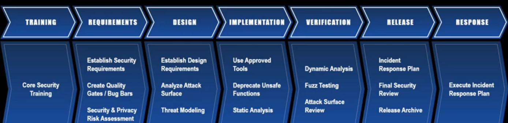

# Week2

시스템 보안은 정보보안의 부분집합

## 소프트웨어 보안

### 소프트웨어의 종류

- Application software
- System software
  - operating systems
  - device drivers
  - uitlities
- Malicious software
  - Spyware : 정보 변형
  - Adware : 광고
  - Ransomware : 파일 암호화

소프트웨어의 중요성이 갈수록 높아짐에 따라 나쁜 소프트웨어도 증가하고 있다.

### 소프트웨어 보안의 정의

- By Laurie Wiliams - NC state
  - 악의적인 공격 하에서도 소프트웨어의 기능이 정상적으로 동작하도록 소프트웨어를 개발하고  테스트하는 아이디어.
    - Firewalling vulnerabilities(x), 취약점 차단과는 다르다.
    - Reacting penetrate and patch(x), 사후 대책과는 다르다.(수동적)
  - 소프트웨어와 관련된 보안 위험을 이해하고 예방하고 완화하는 것
- By Meenakshi Mani & Tanvi Shah
  - 안전한 소프트웨어를 구현하는 모든 것
  - 소프트웨어 보안을 위해 설계하고 구현하고 테스트하는 과정 모두를 말함
  - Pro-active approach,미리 예방하는 접근법(능동적), 소프트웨어를 구현할 때 보안을 내재화 시키자

Pro-active <-> Reactive

### 소프트웨어 개발 프로세스

>Requirements -> Design -> Implementation -> Verification -> Maintenace

>Requirements Analysis -> System Analysis -> System Design -> Implementation -> Development -> Support -> Integration & Testing

각 단계에서 보안을 고려하는 것이 소프트웨어 보안이다.

- Security engineering : 보안 요소(security aspect)에 중점을 둔 공학에서 특정한 분야
  - disruption source를 안전하게 다룰 수 있는 요소들을 다룸
- Software Security : 소프트웨어 개발 프로세스의 전 단계에 걸쳐 보안을 고려하는 것

### SDL(Security Development Lifecycle)

- SDL의 두 가지 목표
  - 공격자에 의해서 악용될 수 있는 취약점을 줄이는 것
  - 남은 취약점들의 심각한 수준을 완화하는 것

- SD3+C
  - Secure by Design : 설계할 때부터 보안 고려
  - Secure by Default : 기본적으로 취약점이 없는 프로그램
  - Secure in Deployment and Communication

SDL은 소프트웨어 개발 프로세스에 보안에 관계된 검사와 대책을 추가하는 것

- Microsoft Security Development Lifecycle
  - 보안 내재화, 보안 설계 철학

Software Security $\not=$ Suecurity Software
 
### Some famous real world attacks

- Ransomware
  - WannaCry ransomware
  - 컴퓨터 시스템을 감염시켜 데이터 접근을 제한하고 돈을 지불 요구
- 비대면 환경의 보안 위협
  - 화상 수업,회의 방해, 취약점 익스플로잇 후 애플리케이션 장악
  - 다크웹을 통해 탈취된 계정정보, 내부정보 판매
  - AI 해킹지능화, 랜섬웨어 고도화, 산업설비 위협, 개인정보 보호 중요성 증대
  - 클라우드 대상 공격 증가
  - 의료분야 집중 공격

- 국가 기반시설 제어망에 대한 사이버 테러, OT 보안 전문 도구 통해 선제적 보안 체계 구축 필요
  - OT : 스마트팩토리, 사회 기반시설, 산업용 시설을 모니터링 하기 위해 사용되는 소프트웨어, 기반시설을 위한 시스템

### 요약

- 데이터와 정보의 차이
- Information, Information System
- Computer Security : 디지털로 된 데이터를 관리하고 보호
- Software Security : 소프트를 개발 전 과정에서 보안을 내재화 해야 한다.
  - System Security, Network Security, Internet Security, Web Security, Mobile Security, ...
- Some famous real world attacks
  - ransomware
  - 비대면 환경의 보안 위협

### 왜 보안이 중요한가

- 데이터와 정보를 보호하는데에도 중요
- 성공적인 비즈니스를 위해 중요
- 한 나라의 경제, 안전을 위해 보안이 중요

### Real world threats/attacks

- 심장박동기 해킹
- 야후 5억명의 개인정보 유출
- 링크드인 개인정보 유출
- 가짜 윈도우10 업데이트 -> 랜섬웨어 공격
- 전력망을 공격하는 악성코드(BlackEnergy malware)
- 2017년 Petya 우크라이나 공격, 랜섬웨어보다 큰 손상을 일으킴
  - Master file table을 암호화 시켜 restart함 -> 부팅 불가능

- 2017 cyberattacks on Ukraine
  - NotPetyua는 일종의 사이버 무기
  - Notpetya는 MEDoc(세무회계 sw)의 업데이트 기능을 통해 감염되어 확산됨
  - MeDoc은 우크라이나의 회계 sw패키지
  - backdoor를 통해 전파
  - worm : 스스로 복제
    - worm이 notpetya를 전파시켰다

- 자율 자동차 보안
  - 2018년 9월 테슬라 애플리케이션을 해킹해 자동차를 훔쳐 도주
  - 세계 자동차 대상 사이버 공격 신고 건수 증가
  - 주로 무선도어 잠금장치, 제작사 서버 공격
  - 국토교통부 -> 자율협력 도로 인프라 보안 대책 확보

### 사이버 공격의 유형

- 피싱
  - 범죄자가 피해자와 이해관계가 있는것 처럼 속여 문자 이메일 링크를 통해 공격
  - Pharming : 정상사이트를 위조하여 공격
- Man in the middle(중간자 공격)
  - 네트워크 패킷을 조작하여 통신 내용을 도청하거나 변조하는 공격 기법
- Drive by download attack
  - 희생자의 동의 없이 악의적인 프로그램을 다운로드 하게 만듬
  - 웹 사이트를 방문하거나 이메일 메시지를 볼 때 유혹하는 팝업 윈도우를 클릭할 때 발생
  - 아무것도 클릭하지 않았는데도 다운로드 될수도 있고, 악의적인 이메일 첨부를 오픈하지 않았는데도 다운로드 될 수 있음. -> 브라우저의 취약점 활용
- Password Attacks
  - 패스워드를 도용하여 나쁜 목적으로 사용
- DDos
  - 분산 서비스 거부 공격
  - 네트워크 패킷을 다량으로 전송, 서버 공격
- Malvertising
  - 인터넷 광고를 하는것처럼 보여 광고를 보는 사람에게 악성코드를 설치하게 만듬. 
- Rogue antivirus
  - 백신 소프트웨어를 사칭하여 이득을 얻는 악성 소프트웨어. 주로 설치된 컴퓨터에 악성코드가 감염되었다는 등의 거짓 내용을 띄워 사용자를 속여 결제 유도

### aryacollege의 사이버 보안 가이드

- 학교 내에서의 사이버 위협 보호
  - VPN을 사용, 네트웍 도메인 중간에 확인, 자동으로 연결되는 기능 비활성화
  - 랩탑을 위치를 추적하는 소프트웨어 설치
  - 사이트에 민감한 정보를 입력하지 말라, 위협이 있어보이는 사이트를 방문하지 말라
  - 체크 카드를 사용할때 ATM을 잘 확인해라.
    - 화면이 깨지거나 플라스틱 장치가 있는 ATM 조심
    - 카드 슬롯에 잘 들어가지 않으면 사용하지 말것
    - pin입력시 키패드를 가리고 할것 ... 등등