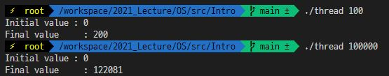

# OSTEP 2장 내용 요약

<div style="text-align: right"> 소프트웨어학과, 32170578, 김산 </div>

## Introduction to Operating Systems

우리가 프로그램을 실행하게 되면 프로그램은 단순히 명령어를 실행할 뿐이지만,
프로세서는 매초 수백만번 메모리로부터 명령어를 fetch하고, 명령어를 decode하고, execute합니다.

이러한 과정이 끝나게 되면 다음 명령어를 수행하며 이러한 과정을 반복하면서 프로세서는 프로그램이 끝날 때까지 반복합니다. 이는 현대 컴퓨터 시스템의 골격인 폰 노이만 모델의 기본적인 동작 과정입니다.

우리는 OS덕에 이러한 과정에 대한 특별한 조치 없이도 쉽게 여러 프로그램을 동시에 수행하고, 프로그램 간의 상호작용을 가능하게 하는 등의 작업이 가능합니다. 또한 OS는 시스템이 안정적이고 효율적으로 동작하도록 돕습니다.

OS는 이러한 기능을 가상화(Virtualization)이라는 기술을 통해 제공합니다. 가상화란 프로세서, 메모리, 디스크와 같은 물리적 자원을 보편적이고 강력하고 쉽게 접근할 수 있는 가상의 형태로 변환하는 것을 말합니다. 이러한 기능때문에 우리는 OS를 virtual machine이라고 부르기도 합니다.

OS는 System call이라는 API를 제공하여 유저가 디바이스에 접근하고, 프로그램을 실행하고 메모리에 접근하는 등의 동작을 가능하게 합니다.
이는 OS가 Application에 standard library를 제공한다 라고도 이야기할 수 있습니다.

또한 여러 프로그램이 동시에 동작할 때 시스템 자원에 대한 접근을 관리하며 프로그램이 효율적이고 안정적으로 동작하도록 돕습니다.

## 2.1 Virtualizing The CPU

```c
int main(int argc, char const *argv[])
{
    if(argc != 2){
        fprintf(stderr, "usage : cpu <string> \n");
        exit(1);
    }
    char *str = argv[1];
    while (1)
    {
        Spin(1);
        printf("%s \n", str);
    }
    return 0;
}
```

<center>[Figure 2.1]</center>


<center>실행결과</center>

예제 프로그램을 백그라운드 실행을 통해 동시에 실행하게 되면 우리는 하나의 프로세서만 가지고 있더라도 여러 프로세서를 통해 동시에 프로그램을 실행하는 것과 같은 착각을 줍니다. 우리는 이를 CPU의 가상화라 부릅니다.

OS는 하나의 CPU를 가상화 하여 수많은 virtual CPU를 생성함으로써 동시에 수많은 프로그램을 실행할 수 있습니다. 여기서 예제 프로그램을 실행하면서 드는 몇 가지 의문들이 있습니다. 어떤 프로그램을 실행하고 중지할지 OS에 전달하기 위해서 API와 같은 인터페이스가 필요한데 이러한 부분을 이 책 전반에 걸쳐 다룹니다.

또한 예제 프로그램처럼 여러 프로그램이 특정시간에 동시에 동작하기를 원할 때 어떤 프로그램이 먼저 동작해야 하는 지와 같은 OS의 정책에 대한 내용, OS의 자원 관리자로서의 역할, OS의 기본적인 작동방식의 구현에 대해 배우게 됩니다.

## 2.2 Virtualizing Memory

```c
int main(){
    int *p = malloc(sizeof(int));
    assert(p != NULL);
    printf("(%d) address pointed to by p: %p\n",getpid(),p);
    *p = 0;
    while(1){
        Spin(1);
        *p = *p + 1;
        printf("(%d) p: %d\n", getpid(), *p);
    }
    return 0;
}
```

<center>[Figure 2.3]</center>


<center>실행결과</center>

>리눅스 커맨드의 세미콜론(;)은 한 라인의 명령어들의 성공, 실패 여부와 관계없이 모두 실행합니다.

위의 예제는 메모리를 할당하고 1씩 증가시키는 연산을 반복수행 시키는 프로그램입니다. 같은 프로그램을 동시에 수행하였을 때 책의 실행결과에서는 같은 주소에 메모리를 할당하였음에도 불구하고 서로 독립적인 변수로 동작하는 것을 보여 가상 메모리의 예를 보여줍니다.

>하지만 실제로 수행해보면 그렇지 않습니다. 같은 프로그램을 수행하더라도 매번 주소가 랜덤하게 출력되는 것을 확인할 수 있습니다. 이는 책의 내용과는 별개로 메모리상의 공격을 어렵게 하기 위해 스택이나 힙, 라이브러리 등의 주소를 랜덤으로 프로세스 주소 공간에 배치하는 ASLR(Address Space Layout Randomization)이라는 보안 기법이 적용되어 있기 때문입니다.
>
>따라서 책의 예제처럼 수행하기 위해서는 쉘에서 다음 명령을 입력하여 해당 옵션을 비활성화 해주면 됩니다. (다시 활성화하기 위해서는 0을 1로 고치면 됩니다)
>
>```c
>echo 0 > /proc/sys/kernel/randomize_va_space
>```
>
>

여기서 OS가 하는 역할은 메모리를 가상화 하는 것입니다. 실행된 각 프로세스는 자신만의 가상주소 공간을 갖고 OS는 이를 물리적인 메모리에 매핑해 줍니다. 덕분에 물리적 메모리는 공유자원이지만 OS에 의해 관리되어 한 프로세스의 메모리 참조가 다른 프로세스나 OS에 영향을 주지 않게 됩니다.

## 2.3 Cuncurrency

```c

volatile int counter = 0;
int loops;

void *worker(void *arg){
    int i;
    for(i = 0; i < loops; i++){
        counter++;
    }
    return NULL;
}

int main(int argc, char const *argv[])
{
    if(argc != 2){
        fprintf(stderr, "usage: threads <value> \n");
        exit(1);
    }
    loops = atoi(argv[1]);
    pthread_t p1, p2;
    printf("Initial value : %d\n", counter);

    Pthread_create(&p1, NULL, worker, NULL);
    Pthread_create(&p2, NULL, worker, NULL);
    Pthread_join(p1, NULL);
    Pthread_join(p2, NULL);
    printf("Final value     : %d\n", counter);
    return 0;
}
```

<center>[Figure 2.5]</center>


<center>실행결과</center>

위 예제 프로그램은 이 책의 또다른 주제인 동시성(concurrency)에 관한 이야기입니다. 예제프로그램은 두 스레드를 생성하여 하나의 함수(worker)를 실행합니다. Final value로 명령인수의 2배에 해당하는 값이 출력될 것이라 예상할 수 있는데, 숫자가 커지니(100,000) 예상한 결과(200,000)에서 한참 벗어나는 값(122,081)이 출력되었습니다.

사실 위 프로그램에서 counter변수를 증가시키는 과정에는 3가지 명령어가 필요합니다. counter를 메모리로부터 레지스터로 load하는 명령, 해당 값을 증가시키는 명령, 메모리로 다시 store하는 명령입니다. 이 세 명령어가 atomically하게 수행되지 않아 예상을 벗어난 값이 출력되는 것입니다. 이러한 동시성에 관한 문제는 이 책의 두번째 파트에서 다루게 됩니다.

## 2.4 Persistence

이 책에서 다루는 세번째 주제는 지속성(persistence)에 관한 것입니다. 시스템 메모리는 휘발성이 있는 DRAM을 기반으로 하기 때문에 데이터를 지속해서 보관할 수 없고 시스템에 문제가 발생하면 데이터를 잃을 수 있습니다. 때문에 데이터를 지속적으로 보관하기 위한 하드웨어와 소프트웨어가 필요합니다.

이러한 하드웨어에는 hard drive와 solid-state drives(SSDs)가 주로 쓰이고 있으며, OS에서는 이러한 Disk를 관리하기 위한 소프트웨어로 file system을 사용합니다.

많은 유저가 파일의 내용을 공유하고 싶어하기 때문에, OS가 CPU와 메모리에 대한 추상화를 제공하는 것처럼 각 응용프로그램에 대해 독립적(private)이고 가상화 된 disk를 제공하지는 않습니다. 예를 들어서 우리가 main이라는 C프로그램을 작성한다 할 때 main.c라는 파일을 에디터(e.g. vi,Emacs,...)를 통해 작성하고 컴파일러를 통해 main.c파일을 컴파일 하여 프로그램을 구현하는 것처럼 파일이 서로 다른 프로세스 간의 공유를 통해 구현되는 것을 확인하실 수 있습니다.

```c
int main(int argc, char const *argv[])
{
    int fd = open("./file", O_WRONLY|O_CREAT|O_TRUNC, S_IRWXU);
    assert(fd > -1);
    int rc = write(fd, "hello world\n", 13);
    assert(rc == 13);
    close(fd);
    return 0;
}
```

<center>[Figure 2.6]</center>


<center>실행결과</center>

위의 코드에서는 open(), write(), close()와 같은 system call을 사용해서 'hello world' 라는 내용이 들어있는 파일을 생성하였습니다. open()을 사용하여 파일을 열거나 생성하고, write()를 통해 파일에 내용을 적고, close()를 사용하여 파일을 닫아 더이상 쓰이지 않게 합니다.

이러한 system call은 OS의 일부분인 file system으로 향합니다. OS는 디스크의 어느 부분에 데이터가 위치할지 결정하고 file system이 가진 다양한 구조로 이를 저장합니다. 파일 구조를 읽고(read) 쓰는(write) 일련의 과정은 저장장치로의 입출력(I/O)을 요구하는데 이러한 복잡한 과정은 장치 드라이버(device driver)를 통해 수행됩니다. 

이렇게 단순히 파일을 생성하고 저장하는 데에도 low-level에서의 깊은 지식을 요구하지만 OS가 system call을 통해 장치에 접근하는 간단한 표준방식을 제공하기 때문에 우리는 간단하게 파일을 생성하고 저장할 수 있습니다.

책의 3번째 주제 지속성(persistence)부분에서는 OS가 어떻게 장치에 접근하는지, 어떻게 디바이스를 통해 파일시스템이 데이터를 지속적으로 관리하는지, 다양한 쓰기방식, 자료구조, 접근방법 등 장치와 입출력 전반, 디스크, RAID 그리고 파일시스템에대해 다룹니다.

## 2.5 Design Goals

OS의 디자인과 구현에 있어서 첫번째 목표는 **높은 성능**을 제공하는 것입니다. 즉, OS의 Overhead를 최소화하는 것입니다.

두번째로 응용프로그램간, 응용프로그램과 OS간의 독립성을 보장함으로써 프로그램의 악의적이거나 우발적인 실행이 다른 프로그램에 영향을 주지 않도록 **보호**하는 것입니다.

세번째로 모든 응용프로그램이 OS에 의존하고 있기 때문에 OS가 멈춘다는 것은 다른 모든 응용프로그램의 중단을 의미합니다. 이러한 의존성 때문에 OS는 높은 **신뢰성**을 제공하는 것을 목표로 합니다.

이외에도 에너지 효율성(Energy-efficiency), 보안성(Security), 유동성(Mobility)이라는 목표가 있습니다. 이러한 OS를 구성하는 원칙들은 다양한 장치에서도 유용합니다.

## 2.6 Some History

### Early Operating Systems: Just Libraries

초기 운영체제는 주로 사용되는 함수들의 라이브러리 역할을 했습니다. 옛날의 메인프레임 시스템에서는 사람에 의해 한번에 하나의 프로그램을 수행하였습니다.

주로 작업들을 모아놓고 한번에 수행하는 Batch Processing을 사용하였습니다.

### Beyond Libraries: Protection

이후 운영체제는 단순한 라이브러리에서 벗어나 시스템 관리에 있어 보다 중심적인 역할을 담당하게 되었습니다. 응용프로그램이 disk의 아무 파일이든 읽을 수 있다면 문제가 발생하기 때문에 OS는 파일 시스템이라는 특별한 라이브러리를 만들어 파일을 관리합니다.

이때문에 시스템 호출(System Call)이라는 개념이 등장하게 되었습니다. 시스템 호출은 OS의 루틴을 라이브러리의 형태로 제공하는 것이 아니라 하드웨어 명령과 하드웨어 상태를 더하여 정형화되고 제어된 프로세스로 만들었습니다.

함수호출과 달리 시스템 호출은 OS로 제어를 전환함과 동시에 하드웨어 권한 수준(hardware privilege level.)을 커널 모드로 상승시킵니다. 유저 애플리케이션의 경우 유저모드에서 동작하여 하드웨어에 대한 제약이 있지만 시스템 호출을 사용하면 Trap handler로 제어를 전환하고 권한 수준을 커널 모드로 상승시킵니다. 커널 모드에서 OS는 시스템의 하드웨어에 대한 완전한 접근 권한을 가지며 입출력을 요청하거나 메모리를 할당하는 동작을 할 수 있게 됩니다. 동작이 완료되면 OS는 return-from trap 명령어를 사용하여 유저로 제어를 넘기고 유저모드로 전환됩니다.

### The Era of Multiprogramming

하드웨어의 자원을 효율적으로 사용하기 위해 multiprogramming이 보편화되기 시작했습니다. OS는 한번에 하나의 작업만 수행하기 보다 여러 작업을 메모리에 로드 하여 빠르게 작업들을 전환함으로써 CPU의 사용률을 높였습니다. 이는 I/O장치와 CPU의 속도차이에 의해 발생하는 CPU자원의 낭비를 줄였습니다. 하지만 이러한 Multiprogramming의 보편화와 더불어 동시성과 관련한 이슈로 인해 memory protection에 대한 중요성도 커졌습니다.

### The Modern Era

개인용 컴퓨터의 등장 후 OS는 minicomputer세대에서 얻은 교훈을 잊은 채(e.g. memory protection, job scheduling) 후퇴를 겪었지만 머지않아 예전 minicomputer의 특징들이 적용되어 나가기 시작했고 OS는 큰 도약을 이루어 내고 OS개발 전성기의 아이디어들이 현대에서 활로를 찾게 됩니다.

## 배우고 싶은 목표

먼저 개인적으로 방학동안 Github블로그를 만들어 보면서 GitHub에 익숙해지기도 했고 상당히 관심이 많이 생겼습니다. 작년에 컴퓨터 구조나 여타 과목들의 과제를 하면서 많이 참고했던 Github인데 이제는 참고만 할 것이 아니라 많은 사람들이 참고할 만한 코드를 커밋하는 게 제 목표입니다. 이번 운영체제 과목에서는 실습이 많은 것으로 알고 있습니다. 단순히 과제로 넘길 것이 아니라 깃 허브에 커밋하여 많은 사람들이 참고하고 피드백 받을 수 있는 경험이 되었으면 좋겠습니다.

앞서 언급한 블로그에서는 제 개인적인 공부를 정리하며 올리는 것에 일기를 써 내려가는 듯한 뿌듯함을 느꼈습니다. 이번 과목에서도 어렵거나 깊게 파본 내용들이 있다면 잘 정리하여 포스팅 하고 싶습니다.

또 방학동안 Docker를 통해 간단하게 웹페이지 배포까지 진행해 보았습니다. 관련 내용을 구글링하면서 찾던 중에 "흔들리는 도커(Docker)의 위상", "이제 React.js 를 버릴 때가 왔다"와 같은 글을 접하게 되었습니다. 빠르게 발전하는 기술 사이에서 기본기도 부족하면서 앞서 프레임워크나 라이브러리와 같은 것들에 너무 의존하다 보면 그만큼 경쟁력이 뒤떨어질 거라는 생각이 들었습니다.

OS강의를 들으면서 단단한 도메인 지식을 가지고, 나중에는 그러한 기술발전에 대해 유연함을 가진 개발자로 성장하고 싶습니다.
