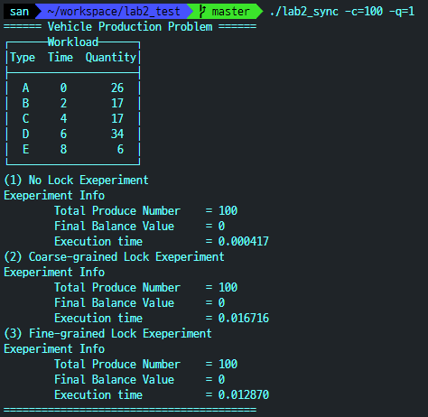

# Operating System Lab 2

<div style="text-align: right"> 운영체제(SW) 2분반, 32170578, 김산 </div>

## [ Lab 2 Vehicle production Problem with Round Robin scheduling]

### A. Implementation

전반적인 구현방식은 다음 그림과 같습니다.


#### 1. 초기화 단계
- `workload.txt`라는 외부 파일을 parse해서 workload를 구성합니다.
  - 이때 `-c` 옵션을 통해 받은 값을 합으로 하는 난수 5개를 생성하여 각각 차량의 생산량(volume)으로 합니다.
  - 따라서 workload는 `차량종류(char c_name)`, `생산 시작시간(star_t)`, `차량 생산량(int volume,int qaunty)`으로 구성되며 `Prod Info *info`라는 전역변수 배열로 저장합니다.
- 차량의 생산라인은 `CarQueue`라는 구조체입니다.
- `ReadyQueue`는 라운드 로빈 방식으로 차량의 생산 순서를 계산하기 위해 라운드 로빈 함수에서 사용되는 큐입니다.
- `order`배열은 라운드 로빈을 수행후 생성된 차량 생산 순서를 차량 종류로 저장한 입니다.

#### 2. 생산 단계
- 생산 단계는 Unlock`(lab2_uprod.c)`, Coarse-grained Lock`(lab2_cprod.c)`, Fine-grained Lock`(lab2_fprod.c)`, 세가지 함수를 통해 각각 상황에 맞게 구현하였습니다. 
- Unlock의 경우 1개의 Producer함수 `u_prod()`와 5개의 Consumer 함수 `u_consA()`,`u_consB()`,`u_consC()`,`u_consD()`,`u_consE()`로 구성하였습니다. 
  - Producer함수는 생산 순서에따라 생산 라인이 꽉 차지 않은경우`(cq.balance < LINE_SIZE)` 출고를 진행하며, 모든 차량이 출고되기까지 반복합니다.
  - Consumer함수는 생산 라인이 비어있지 않고`(cq.balance > 0)` 모든 차량이 출고되기까지 각각에 해당하는 차량을 생산라인에서 가져오기를 반복합니다.

#### 3. 락 구현
- Coarse-grained lock
  - 임계영역(생산라인 큐 접근)에 진입할때 mutex lock을 사용하여 lock을 걸고 진입합니다
  - **생산자**는 라인이 꽉찬경우 소비자가 `get()`할때까지 condition wait를 통해 기다립니다.
  - **소비자**는 라인이 비어있는경우 생산자가 `put()`할때까지 contition wait를 통해 기다립니다.
  - 생산자가 모든 생산을 완료하고 종료된경우 소비자를 깨우지 못하므로 큐가 모두 비워질 때 까지 생산자는 다음과 같이 `pthread_cond_broadcast(&fill)`를 반복합니다.
```c
    ...
    while(cq.balance > 0) {
        pthread_cond_broadcast(&fill);
    }
    ...
```
- Fine-graiend lock
  - 1개의 Lock(`mutex`)을 사용한 Coarse-grained lock과 달리 2개의 lock(head, tail)을 통해 구현하였습니다.
  - 생산자는 `tail` lock을 통해 임계영역에 접근하며, 소비자는 `head` lock을 통해 임계 영역에 접근합니다.
  - 다만 이경우 생산자, 소비자 스레드가 각각 동시에 공유자원에 접근할 수 있어 동시성은 높아지지만, 생산자, 소비자 모두 balance라는 공유자원을 사용하여, 상호배제를 달성할 수 없기 때문에 lock이 깨지는 경우가 발생할 수 있습니다.

### B. Result Report

1. Case 1  

2. Case 2  

3. Case 3  

4. Case 4  

5. Case 5  

6. Case 6  

7. Case 7  


### C. Discussion
- No lock의 경우 Lock이 있는경우보다 보통 속도가 더 빨랐지만, 경쟁상태가 발생하는 경우(case 5)가 일부 발생하였습니다.
- 다만 이렇게 경쟁상태가 발생하는 경우가 빈번하지 않아 성능과의 trade off를 고려한다면 데이터의 무결성이 크게 중요하지 않은경우에는 굳이 Lock을 사용하지 않아도 될것 같다, 또는 Lock을 사용해야하는 경우를 줄여야겠다 라는 생각이 들었습니다.
- 구현하면서 임계영역이라 생각되는 부분이 줄어 들수록 경쟁상태가 발생하는 경우가 줄어들었습니다. 예를들어 balance와 관련한 연산이 많게 구현을 했을때 경쟁상태가 빈번하게 발생하였고, 공유자원과 관련한 연산을 줄일수록 unlock상태에서도 경쟁상태가 많이 줄어 들었습니다. 따라서 lock을 먼저 생각하기 전에 atomic하게 구현하는게 우선이라는 생각이 들었습니다.
- Fine-grained Lock과 Coarse-grained lock의 속도 비교는 time quantum이 1인 경우(case 1,3)에서는 fine grained가 앞서는 경향을 보여주었습니다. 하지만 time quantum을 4로 바꾼경우 coarse grained의 경우보다 속도가 떨어졌습니다.
  - pthread_broadcast는 리눅스의 man설명에 따르면
  - >If more than one thread is blocked on a condition  variable, the  scheduling policy determines the order in which threads are unblocked.
  - 라고 되어있는데 리눅스의 기본 스케줄러는 CFS이므로 같은 차량이 연속적으로 출고되는 경우에 불리할 것이라 생각합니다(왜냐하면 같은 스레드가 또한번 스케줄링 되는데 시간이 더 걸리므로)
  - 이부분에 대해서 제생각을 좀더 자세히 말씀 드리면 time quantum이 4일때는 같은 차량이 연속적으로 출고되는 경향이 있습니다. 이때 coarse grained의 경우에는 생산자와 소비자 스레드가 하나의 lock으로 묶여있어 6개의 스레드가 스케줄링 경합을 합니다. 반면 fine-grained의 경우 5개의 소비자 스레드가 스케줄링 경합을 하는데 이렇게 되면 **스레드가 연속으로 스케줄링 되어도 fairness를 떨어뜨리는 정도가 6개일때(coarse-grained)보다 5개일때(fine-grained)가 더 크기 때문**입니다.
- 이 외에도 Fine-grained lock의 경우 `balace`에 의해서 출고 차량이 많아질수록 데드락이 많이 발생하여 생산시간을 측정할 수 없었습니다(case 5, 7). 생산자든 소비자든, balance라는 공유자원을 사용하여 큐에 출고하고 소비하는 것이 결정되기 때문에 결국 Fine-grained로 구현할 수 없는것 아닌가라는 의문이 듭니다. 이경우 최선은 최대한 atomic하게 구현하거나, Coarse-grained lock을 사용하는 수 밖에 없어 보입니다. 

### E. Appendix
**Valgrind**  
프로그램을 작성하다 보니 동적할당후 메모리해제를 해주지 않아 문제가 발생한 경우가 있었습니다. 이경우 메모리 누수를 방지하기 위해서 valgrind라는 프로그램을 사용하여 문제가 되는 부분을 찾아 해결해 주었습니다. 

- 누수 발생

- 누수 해결


